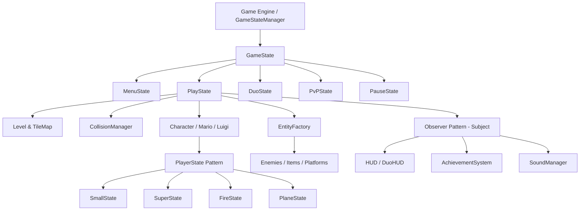

# 🍄 Super Mario Game (C++ / SFML)

[](https://github.com/pqquyenn/SuperMarioGame/actions/workflows/ci.yml)


A feature-rich, object-oriented recreation and modernization of the legendary **Super Mario** game built with **C++17** and **SFML (Simple and Fast Multimedia Library)**. The game incorporates clean architecture adhering to **SOLID principles** and classic software design patterns, offering Singleplayer adventures, 2-Player Cooperative mode, and 1v1 PvP Arena battles.

---

## 📑 Table of Contents

- [🎮 Game Modes](#-game-modes)
- [✨ Key Features](#-key-features)
- [🕹️ Default Controls](#️-default-controls)
  - [Solo Mode](#solo-mode)
  - [Duo Mode (2-Player Co-op)](#duo-mode-2-player-co-op)
  - [PvP Arena Mode (1v1)](#pvp-arena-mode-1v1)
  - [🛠️ Debug & Admin Shortcuts](#️-debug--admin-shortcuts)
- [🏗️ Software Architecture & Design Patterns](#️-software-architecture--design-patterns)
- [📁 Project Structure](#-project-structure)
- [⚙️ Prerequisites & Installation](#️-prerequisites--installation)
  - [Windows](#windows)
  - [Linux (Ubuntu / Debian)](#linux-ubuntu--debian)
  - [macOS](#macos)
- [🚀 Building and Running](#-building-and-running)
- [👥 Authors & Acknowledgments](#-authors--acknowledgments)

---

## 🎮 Game Modes

| Mode | Description |
| :--- | :--- |
| **🌟 Solo Mode** | Journey through **World 1 (Levels 1-1 to 1-4)**. Overcome classic enemies, discover underground pipes, collect mystery coins/power-ups, dodge obstacles, and reach the flagpole! |
| **👥 Duo Mode (Co-op)** | Two players on one screen playing together as **Mario** and **Luigi** with a shared dynamic camera and cooperative gameplay rules. |
| **⚔️ PvP Arena Mode** | Intense **1v1 Combat** across specialized battlegrounds (`Friendly Arena`, `Small Arena`, `Super Arena`). Battle using stomps, fireball barrages, and power-up advantages with custom life stock rules. |

---

## ✨ Key Features

- **Character Selection & Customization:**
  - Play as **Mario** 🔴 or **Luigi** 🟢 with authentic sprites, color palettes, and jump dynamics.
- **Power-Up Evolution & States:**
  - 🍄 **Small Mario / Luigi**: Default form.
  - 🍄 **Super Mario / Luigi**: Increased height, ability to smash brick blocks.
  - 🔥 **Fire Mario / Luigi**: Throws bouncing fireballs to defeat enemies at a distance.
  - ✈️ **Plane / Flight State**: Special flight mode armed with yellow lasers.
  - ⭐ **Starman Invincibility**: Rainbow flashing effect, contact-kill, and speed multiplier.
  - 🛡️ **Shield & Damage Immunity**: Post-hit invincibility frames with flashing visuals.
- **Enemy Roster & Bosses:**
  - **Goomba**: Classic patrolling walking fungus.
  - **Koopa Troopa (Green / Red)**: Retracts into a kickable shell upon stomp.
  - **Paratroopa (Green / Red)**: Flying / jumping airborne turtles.
  - **Piranha Plant**: Emerging ambush hazards inside vertical pipes.
  - **Dragon Lugia**: Custom boss encounter.
- **Rich Level Mechanics:**
  - Interactive Question Blocks `[?]`, Brick Blocks, Hard Blocks, and Invisible Blocks.
  - Sub-levels (Underground caverns, castles) accessible via pipe portals.
  - Moving Platforms, falling pits, coins, and flagpoles with smooth score tallying.
- **Modern User Interface & Polish:**
  - *New Super Mario Bros. U Deluxe*-inspired menu system with animated clouds, character cards, and sound effects.
  - Comprehensive **Achievements System** with persistent progress saved to disk.
  - In-game customizable **Keybindings** with collision and conflict validation.
  - Complete audio suite featuring 6 iconic music tracks and 21+ sound effects.

---

## 🕹️ Default Controls

All controls can be customized directly in the in-game **Settings > Key Bindings** menu.

### Solo Mode

| Action | Primary Key |
| :--- | :--- |
| **Move Left** | `Left Arrow` |
| **Move Right** | `Right Arrow` |
| **Jump** | `Up Arrow` |
| **Crouch / Enter Pipe** | `Down Arrow` |
| **Action (Fireball / Laser)** | `Z` |
| **Run / Sprint** | `Left Shift` |
| **Interact** | `E` |
| **Pause Game** | `Escape` |

### Duo Mode (2-Player Co-op)

| Action | Player 1 (Mario) | Player 2 (Luigi) |
| :--- | :--- | :--- |
| **Move Left** | `A` | `Left Arrow` |
| **Move Right** | `D` | `Right Arrow` |
| **Jump** | `W` | `Up Arrow` |
| **Crouch** | `S` | `Down Arrow` |
| **Action / Fire** | `Z` | `Numpad 1` |
| **Sprint / Run** | `Left Shift` | `Numpad 0` |
| **Interact** | `E` | `Enter` |

### PvP Arena Mode (1v1)

| Action | Player 1 | Player 2 |
| :--- | :--- | :--- |
| **Move Left** | `A` | `Left Arrow` |
| **Move Right** | `D` | `Right Arrow` |
| **Jump** | `W` | `Up Arrow` |
| **Crouch** | `S` | `Down Arrow` |
| **Action / Fire** | `Z` | `J` |
| **Sprint / Run** | `Left Shift` | `Right Shift` |
| **Interact** | `E` | `Enter` |

### 🛠️ Debug & Admin Shortcuts

| Key | Debug Action |
| :--- | :--- |
| `T` | **Toggle Admin Debug Overlay** (Coordinates, Form, Speed, Bounding Box) |
| `Y` | **Record Movement Trail** (8-second motion trajectory visualization) |
| `I` | **Grant Star Invincibility** (Immediate invincibility state) |
| `K` | **Promote Power-Up Form** (`Small` $\rightarrow$ `Super` $\rightarrow$ `Fire`) |
| `L` | **Force Damage / Demote Form** |
| `P` | **Spawn Star Item** directly in front of the player |
| `V` | **Toggle Free Camera Mode** (Move camera freely with Arrow keys + `Shift`) |
| `U` / `H` | **Force Trigger Portal** to next sub-level/pipe |
| `M` / `1` | **Teleport Back** to Level Spawn Point |

---

## 🏗️ Software Architecture & Design Patterns

The codebase is built with strict adherence to **Object-Oriented Programming (OOP)** and **SOLID design principles**:



- **State Pattern (`GameState`, `PlayerState`):** Handles seamless transitions between game screens (Menu, Gameplay, Pause, PvP, GameOver) and dynamic player transformations (Small, Super, Fire, Plane).
- **Command Pattern (`ICommand`):** Encapsulates player intent (`MoveCommand`, `JumpCommand`, `CrawlCommand`, `FireCommand`), enabling rebindable inputs and clean action execution.
- **Observer Pattern (`Subject`, `Observer`, `Event`):** Decouples game events (Coin collected, Enemy killed, Damage taken, Level cleared) from the `HUD`, `AchievementSystem`, and `SoundManager`.
- **Factory Pattern (`EntityFactory`, `EntityAssetProvider`):** Centralizes dynamic creation of enemies, items, fireballs, and tiles from level definitions.
- **Singleton / Service Locator:** Ensures unified access to global managers (`AssetManager`, `SoundManager`, `AchievementSystem`, `KeyBindingService`).

---

## 📁 Project Structure

```
SuperMarioGame/
├── .github/
│   └── workflows/
│       └── ci.yml                 # Multi-platform CI (Windows, Linux, macOS)
├── assets/
│   ├── audio/
│   │   ├── effects/               # 21+ SFX (.wav)
│   │   └── music/                 # 6 BGM tracks (.wav)
│   ├── config/                    # Entity catalog definition
│   ├── fonts/                     # Retro & Clean TTF Fonts
│   ├── maps/                      # Level layouts (1-1, 1-2, 1-3, 1-4, PvP arenas)
│   ├── sprites/                   # Characters, enemies, blocks, effects, icons
│   └── state/                     # Menu cards and background artwork
├── include/                       # Header files organized by module
│   ├── AdminControl/              # Debug view and movement trail
│   ├── Animation/                 # Sprite animator & clip structures
│   ├── Commands/                  # Input command classes
│   ├── Core/                      # Game, AssetManager, SoundManager, Achievements
│   ├── Duo/                       # 2-Player Co-op rules and types
│   ├── Entities/                  # Mario, Luigi, Enemies, Items, Projectiles
│   ├── Factories/                 # Entity & Asset factories
│   ├── Input/                     # Key binding services & input handlers
│   ├── Level/                     # Level loader, TileMap, Camera
│   ├── Observer/                  # Subject, Observer, Event bus
│   ├── Physics/                   # AABB Collision & contact resolution
│   ├── PlayerEffects/             # Star, Shield, and Invincibility effects
│   ├── PlayerStates/              # Small, Super, Fire, Plane states
│   ├── PvP/                       # Combat resolver, camera policy, arena rules
│   ├── States/                    # Game states (Menu, Play, Pause, PvP, etc.)
│   └── UI/                        # Heads-Up Displays
├── src/                           # Implementation source files (.cpp)
├── CMakeLists.txt                 # Modern CMake build configuration
└── .gitignore
```

---

## ⚙️ Prerequisites & Installation

To build and run the game from source, ensure you have the following installed:

- **CMake**: version `3.20` or higher ([Download CMake](https://cmake.org/download/))
- **C++17 Compliant Compiler**:
  - **Windows**: Visual Studio 2019/2022 (MSVC) or MinGW-w64 (GCC 9+)
  - **Linux**: GCC 9+ or Clang 10+
  - **macOS**: Apple Clang / Xcode Command Line Tools
- **SFML**: version `2.6.1`
  > 💡 *Note: You do not need to install SFML manually! If SFML is not found on your system, CMake will automatically download, configure, and link it via `FetchContent`.*

### Linux (Ubuntu / Debian) Dependencies

If compiling on Linux, install the required graphics and audio development packages:

```bash
sudo apt-get update
sudo apt-get install -y \
  cmake g++ \
  libxrandr-dev libxcursor-dev libxi-dev libudev-dev \
  libflac-dev libvorbis-dev libogg-dev \
  libgl1-mesa-dev libegl1-mesa-dev \
  libfreetype-dev libopenal-dev
```

### macOS Dependencies

```bash
brew install cmake
```

---

## 🚀 Building and Running

### 1. Clone the repository

```bash
git clone https://github.com/pqquyenn/SuperMarioGame.git
cd SuperMarioGame
```

### 2. Configure with CMake

```bash
cmake -B build -DCMAKE_BUILD_TYPE=Release
```

### 3. Build the Project

```bash
cmake --build build --config Release --parallel
```

### 4. Run the Game

- **Windows:**
  ```cmd
  .\build\bin\Release\mario.exe
  # or if using MinGW/Ninja:
  .\build\bin\mario.exe
  ```
- **Linux / macOS:**
  ```bash
  ./build/bin/mario
  ```

*(Assets and required dynamic libraries are automatically copied to the executable directory post-build).*

---

## 👥 Authors & Acknowledgments

This project was developed by:

- **Phạm Quốc Quyền** ([@pqquyenn](https://github.com/pqquyenn))
- **Đặng Minh Nhật** ([@dmnhat2533](https://github.com/dmnhat2533))
- **Lương Nhật Minh** ([@luongnhatinh](https://github.com/luongnhatinh))
- **Lê Phan Đức Mẫn** ([@LePhanDucMan](https://github.com/LePhanDucMan))

*Advanced Program in Computer Science (APCS) — Faculty of Information Technology, University of Science, VNU-HCM (HCMUS).*

---

<div align="center">
  <sub>Built with ❤️ and C++17. Original Super Mario assets and concepts &copy; Nintendo.</sub>
</div>
