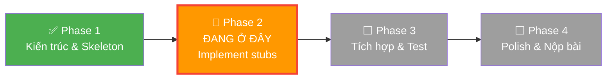
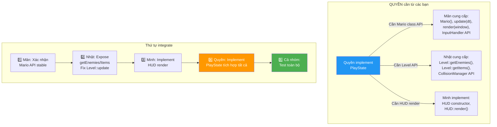
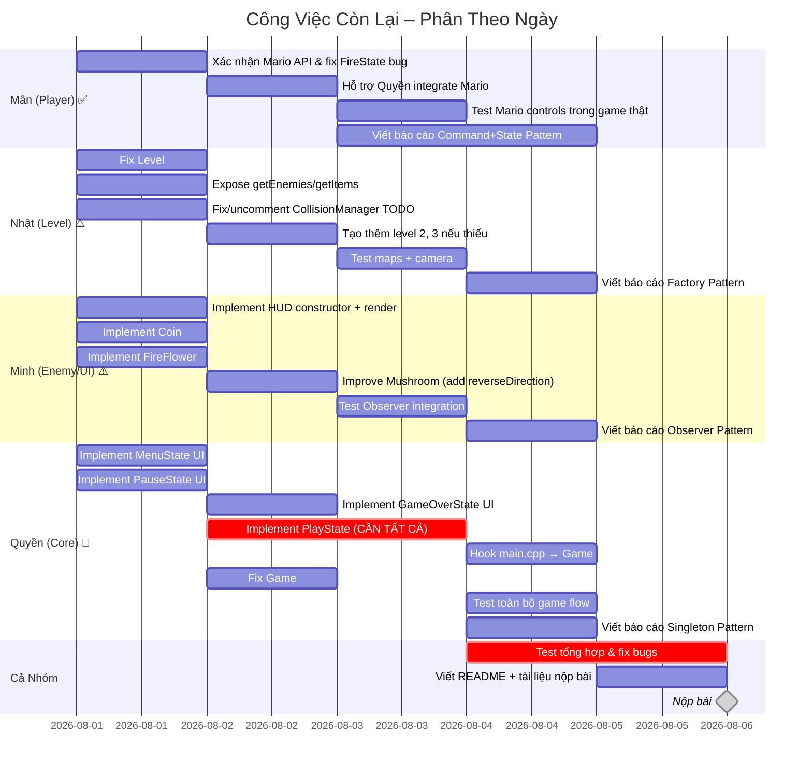

# 📋 Hướng Dẫn Công Việc Chi Tiết – Super Mario Bros 2D (C++/SFML)

> [!CAUTION]
> Tài liệu này dựa trên **phân tích source code thực tế** của project. Một số module đã code xong, nhưng **nhiều file quan trọng vẫn là STUB/SKELETON** với các TODO chưa được implement. Mỗi người đọc đúng phần của mình và thực hiện theo thứ tự.

---

## 🔍 Trạng Thái THỰC TẾ Của Project (Phân Tích Source Code)



### Bảng trạng thái thực tế từng file:

| File | Người | Trạng thái | Vấn đề cụ thể |
|------|-------|-----------|----------------|
| `main.cpp` | Nhật/Quyền | ⚠️ Sandbox mode | Đang test Level/Camera trực tiếp, **CHƯA gọi `Game::run()`** |
| `Game.cpp` | Quyền | ⚠️ Thiếu | `fixedUpdate()` **empty** – có TODO |
| `MenuState.cpp` | Quyền | ❌ **STUB** | `onEnter()`, `update()`, `render()` **đều empty** – có TODO |
| `PlayState.cpp` | Quyền | ❌ **STUB** | `onEnter()`, `handleInput()`, `update()`, `render()` **đều empty** – có TODO |
| `PauseState.cpp` | Quyền | ❌ **STUB** | `onEnter()`, `update()`, `render()` **đều empty** – có TODO |
| `GameOverState.cpp` | Quyền | ❌ **STUB** | `onEnter()`, `update()`, `render()` **đều empty** – có TODO |
| `HUD.cpp` | Minh | ❌ **STUB** | Constructor **empty**, `render()` **empty** |
| `Level.cpp` | Nhật | ⚠️ Thiếu | `update(dt)` **empty** |
| `CollisionManager.cpp` | Nhật | ⚠️ Thiếu | `resolveEntityCollisions()` có code **bị comment out** – cần `onCollision` method |
| `Coin.cpp` | Minh | ❌ **STUB** | `update(dt)` **empty** – không có animation |
| `FireFlower.cpp` | Minh | ❌ **STUB** | `update(dt)` **empty** – không có animation |
| `Camera.cpp` | Nhật | ℹ️ Empty file | Logic nằm hết trong `Camera.h` (header-only) – OK |
| `AssetManager.*` | Quyền | ✅ Xong | Singleton Pattern hoàn chỉnh |
| `SoundManager.*` | Quyền | ✅ Xong | Singleton Pattern hoàn chỉnh |
| `SaveSystem.*` | Quyền | ✅ Xong | Save/Load hoàn chỉnh |
| `GameStateManager.*` | Quyền | ✅ Xong | Stack-based, deferred actions |
| `Entity/Character/Mario/Luigi` | Mân | ✅ Xong | Physics, state, effects đầy đủ |
| `Commands/* + InputHandler` | Mân | ✅ Xong | Command Pattern hoàn chỉnh |
| `PlayerStates/*` | Mân | ✅ Xong | Small/Super/Fire + damage downgrade |
| `PlayerEffects/*` | Mân | ✅ Xong | Invincibility, Shield, Star effects |
| `Goomba/Koopa/PiranhaPlant` | Minh | ✅ Xong | AI movement, stomp logic, shell mechanics |
| `Mushroom.*` | Minh | ✅ Cơ bản | Di chuyển ngang, chưa quay đầu khi chạm tường |
| `TileMap.*` | Nhật | ✅ Xong | Flyweight tiles, double-buffered render |
| `Tile.*` | Nhật | ✅ Xong | Tile types, solid check |
| `Level.*` (load/render) | Nhật | ✅ Xong | Load map + entities |
| `Camera.h` | Nhật | ✅ Xong | Smooth scrolling, boundary clamp |
| `CollisionManager` (AABB) | Nhật | ✅ Xong | Tile collision resolve |
| `EntityFactory.*` | Nhật | ✅ Xong | Registry pattern |
| `Observer/Subject/Event` | Minh | ✅ Xong | Observer Pattern core |
| Maps (`1-1.txt`, etc.) | Nhật | ✅ Xong | Overworld + Underground |

---

## 👤 PHAN QUỲNH QUYỀN – Engine & Core Architecture

### 🎯 Nhiệm vụ: Implement 4 Game States (Menu/Play/Pause/GameOver) – hiện tất cả đều là STUB

> [!WARNING]
> **4 file State quan trọng nhất của Quyền đều đang TRỐNG (chỉ có TODO comments).** Đây là phần **QUAN TRỌNG NHẤT** vì không có States hoạt động thì game không chạy được.

---

### 🔴 Việc 1: Implement `PlayState` (QUAN TRỌNG NHẤT)

**File cần sửa:** [PlayState.h](file:///c:/SuperMarioGame/include/States/PlayState.h) và [PlayState.cpp](file:///c:/SuperMarioGame/src/States/PlayState.cpp)

**Hiện trạng:** Tất cả methods đều empty, chỉ có key press handler cho Escape.

**Quyền cần làm CỤ THỂ:**

#### Bước 1.1 – Thêm member variables vào `PlayState.h`:

```cpp
// === CẦN THÊM vào class PlayState trong PlayState.h ===
#include "Level/Level.h"
#include "Level/Camera.h"
#include "Entities/Mario.h"
#include "Input/InputHandler.h"
#include "Physics/CollisionManager.h"
#include "UI/HUD.h"
#include "Observer/Event.h"

class PlayState : public GameState {
private:
    sf::RenderWindow& window;
    
    // === CÁC OBJECT CHÍNH CỦA GAMEPLAY ===
    std::unique_ptr<Level> level;           // Bản đồ (Nhật đã code)
    std::unique_ptr<Mario> mario;           // Nhân vật (Mân đã code)
    std::unique_ptr<InputHandler> inputHandler;  // Điều khiển (Mân đã code)
    Camera camera;                          // Camera (Nhật đã code)
    HUD hud;                               // Hiển thị (Minh đang code)
    
    int currentLevel = 1;                   // Level hiện tại (1-3)
    bool isGameOver = false;
    
public:
    // ... constructor, methods ...
};
```

#### Bước 1.2 – Implement `PlayState::onEnter()`:

```cpp
void PlayState::onEnter() {
    // 1. Load level
    level = std::make_unique<Level>();
    level->loadLevel("assets/maps/1.1/1-1.txt");  // Kiểm tra path đúng
    
    // 2. Tạo Mario tại vị trí spawn
    mario = std::make_unique<Mario>();
    mario->setPosition(100.f, 400.f);  // Vị trí spawn đầu level
    
    // 3. Setup InputHandler
    inputHandler = std::make_unique<InputHandler>();
    
    // 4. Setup Camera
    camera = Camera(800.f, 600.f);  // Kích thước window
    camera.setLevelBounds(level->getTileMap().getMapWidth() * 16.f,
                          level->getTileMap().getMapHeight() * 16.f);
    
    // 5. Đăng ký Observer: Mario → HUD (QUAN TRỌNG cho Observer Pattern)
    mario->addObserver(&hud);
    
    // 6. Play nhạc nền
    SoundManager::getInstance().playBGM("assets/audio/overworld.ogg");
}
```

#### Bước 1.3 – Implement `PlayState::handleInput()`:

```cpp
void PlayState::handleInput(const sf::Event& event) {
    // Escape → Push PauseState
    if (event.type == sf::Event::KeyPressed && event.key.code == sf::Keyboard::Escape) {
        stateManager->pushState(std::make_unique<PauseState>(window, *stateManager));
        return;
    }
}
```

#### Bước 1.4 – Implement `PlayState::update(float dt)`:

```cpp
void PlayState::update(float dt) {
    if (isGameOver) return;
    
    // 1. Xử lý input → tạo Commands → execute trên Mario
    inputHandler->handleInput(*mario, dt);
    
    // 2. Update Mario (physics, animation, state)
    mario->update(dt);
    
    // 3. Update Level (enemies, items)
    level->update(dt);
    
    // 4. Xử lý va chạm
    //    a) Mario vs TileMap
    CollisionManager::resolveTileCollisions(*mario, level->getTileMap());
    
    //    b) Mario vs Enemies (cần lấy list enemies từ Level)
    // TODO: Khi Nhật expose getEnemies() từ Level, thêm vào đây
    
    //    c) Mario vs Items
    // TODO: Khi Nhật expose getItems() từ Level, thêm vào đây
    
    // 5. Update Camera theo vị trí Mario
    camera.update(mario->getPosition());
    
    // 6. Update HUD
    hud.update(dt);
    
    // 7. Kiểm tra Mario chết
    if (!mario->isAlive()) {
        // Mario rơi xuống hố hoặc hết mạng
        stateManager->changeState(
            std::make_unique<GameOverState>(window, *stateManager, hud.getScore())
        );
    }
}
```

#### Bước 1.5 – Implement `PlayState::render()`:

```cpp
void PlayState::render(sf::RenderWindow& window) {
    // 1. Áp dụng Camera view
    window.setView(camera.getView());
    
    // 2. Vẽ Level (tilemap + enemies + items)
    level->render(window);
    
    // 3. Vẽ Mario
    mario->render(window);
    
    // 4. Reset về default view để vẽ HUD (HUD cố định trên màn hình)
    window.setView(window.getDefaultView());
    
    // 5. Vẽ HUD
    hud.render(window);
}
```

> [!IMPORTANT]
> **Quyền cần phối hợp với cả 3 người:**
> - Hỏi **Mân**: `mario->update(dt)` cần truyền gì? `InputHandler::handleInput()` signature?
> - Hỏi **Nhật**: `level->getEnemies()` và `level->getItems()` đã có chưa? `CollisionManager` gọi thế nào?
> - Hỏi **Minh**: `hud.render(window)` đã implement chưa? `mario->addObserver(&hud)` có hoạt động không?

---

### 🔴 Việc 2: Implement `MenuState` 

**File cần sửa:** [MenuState.cpp](file:///c:/SuperMarioGame/src/States/MenuState.cpp)

**Hiện trạng:** `onEnter()`, `update()`, `render()` đều empty với TODO comments.

```cpp
// === IMPLEMENT MenuState::onEnter() ===
void MenuState::onEnter() {
    // Load font
    auto& assets = AssetManager::getInstance();
    
    // Tạo tiêu đề
    titleText.setFont(assets.getFont("pixel_font"));
    titleText.setString("SUPER MARIO BROS");
    titleText.setCharacterSize(48);
    titleText.setFillColor(sf::Color::White);
    // Căn giữa màn hình
    sf::FloatRect bounds = titleText.getLocalBounds();
    titleText.setPosition(400.f - bounds.width / 2.f, 150.f);
    
    // Tạo text "Press Enter to Start"
    startText.setFont(assets.getFont("pixel_font"));
    startText.setString("PRESS ENTER TO START");
    startText.setCharacterSize(24);
    startText.setFillColor(sf::Color::White);
    bounds = startText.getLocalBounds();
    startText.setPosition(400.f - bounds.width / 2.f, 350.f);
    
    // Play menu music (nếu có)
    // SoundManager::getInstance().playBGM("assets/audio/menu.ogg");
}

// === IMPLEMENT MenuState::update() ===
void MenuState::update(float dt) {
    // Animation nhấp nháy cho text "Press Enter"
    blinkTimer += dt;
    if (blinkTimer >= 0.5f) {
        showStartText = !showStartText;
        blinkTimer = 0.f;
    }
}

// === IMPLEMENT MenuState::render() ===
void MenuState::render(sf::RenderWindow& window) {
    // Background màu xanh dương (sky color)
    window.clear(sf::Color(92, 148, 252));
    
    // Vẽ tiêu đề
    window.draw(titleText);
    
    // Vẽ "Press Enter" (nhấp nháy)
    if (showStartText) {
        window.draw(startText);
    }
}
```

**Cần thêm vào `MenuState.h`:**
```cpp
sf::Text titleText;
sf::Text startText;
float blinkTimer = 0.f;
bool showStartText = true;
```

---

### 🔴 Việc 3: Implement `PauseState`

**File cần sửa:** [PauseState.cpp](file:///c:/SuperMarioGame/src/States/PauseState.cpp)

```cpp
void PauseState::onEnter() {
    auto& assets = AssetManager::getInstance();
    
    // Overlay bán trong suốt
    overlay.setSize(sf::Vector2f(800.f, 600.f));
    overlay.setFillColor(sf::Color(0, 0, 0, 128));  // Đen 50% opacity
    
    // Text "PAUSED"
    pausedText.setFont(assets.getFont("pixel_font"));
    pausedText.setString("PAUSED");
    pausedText.setCharacterSize(48);
    pausedText.setFillColor(sf::Color::White);
    sf::FloatRect bounds = pausedText.getLocalBounds();
    pausedText.setPosition(400.f - bounds.width / 2.f, 200.f);
    
    // Text hướng dẫn
    resumeText.setFont(assets.getFont("pixel_font"));
    resumeText.setString("Press ESC to Resume\nPress Q for Main Menu");
    resumeText.setCharacterSize(20);
    resumeText.setFillColor(sf::Color(200, 200, 200));
    resumeText.setPosition(250.f, 320.f);
    
    // Dừng nhạc nền
    SoundManager::getInstance().stopBGM();
}

void PauseState::render(sf::RenderWindow& window) {
    // Vẽ overlay đen bán trong suốt lên trên game đang pause
    window.draw(overlay);
    window.draw(pausedText);
    window.draw(resumeText);
}
```

**Cần thêm vào `PauseState.h`:**
```cpp
sf::RectangleShape overlay;
sf::Text pausedText;
sf::Text resumeText;
```

---

### 🔴 Việc 4: Implement `GameOverState`

**File cần sửa:** [GameOverState.cpp](file:///c:/SuperMarioGame/src/States/GameOverState.cpp)

```cpp
void GameOverState::onEnter() {
    auto& assets = AssetManager::getInstance();
    
    // Text "GAME OVER"
    gameOverText.setFont(assets.getFont("pixel_font"));
    gameOverText.setString("GAME OVER");
    gameOverText.setCharacterSize(48);
    gameOverText.setFillColor(sf::Color::Red);
    sf::FloatRect bounds = gameOverText.getLocalBounds();
    gameOverText.setPosition(400.f - bounds.width / 2.f, 150.f);
    
    // Hiển thị Score cuối cùng
    scoreText.setFont(assets.getFont("pixel_font"));
    scoreText.setString("FINAL SCORE: " + std::to_string(finalScore));
    scoreText.setCharacterSize(24);
    scoreText.setFillColor(sf::Color::White);
    bounds = scoreText.getLocalBounds();
    scoreText.setPosition(400.f - bounds.width / 2.f, 280.f);
    
    // Hướng dẫn
    promptText.setFont(assets.getFont("pixel_font"));
    promptText.setString("Press ENTER to return to Menu");
    promptText.setCharacterSize(20);
    promptText.setFillColor(sf::Color(200, 200, 200));
    bounds = promptText.getLocalBounds();
    promptText.setPosition(400.f - bounds.width / 2.f, 380.f);
    
    SoundManager::getInstance().stopBGM();
}

void GameOverState::render(sf::RenderWindow& window) {
    window.clear(sf::Color::Black);
    window.draw(gameOverText);
    window.draw(scoreText);
    window.draw(promptText);
}
```

---

### 🟡 Việc 5: Fix `Game::fixedUpdate()` TODO

**File:** [Game.cpp](file:///c:/SuperMarioGame/src/Core/Game.cpp) – dòng 54

**Hiện trạng:** Method body empty, có TODO comment.

```cpp
// === THAY THẾ fixedUpdate() empty bằng: ===
void Game::fixedUpdate(float fixedDt) {
    // Delegate physics update cho state hiện tại
    // State (PlayState) sẽ tự xử lý physics bên trong update()
    // Hiện tại có thể để trống nếu physics được xử lý trong update()
    // Hoặc tách riêng:
    if (!stateManager.isEmpty()) {
        // stateManager.getCurrentState()->fixedUpdate(fixedDt);
        // Nếu GameState chưa có fixedUpdate(), bỏ qua bước này
    }
}
```

> [!TIP]
> Nếu physics đã được xử lý trong `PlayState::update()`, thì `fixedUpdate()` có thể để trống. Quan trọng là game loop chạy đúng 60 FPS.

---

### 🟡 Việc 6: Hook `main.cpp` vào Game Engine

**File:** [main.cpp](file:///c:/SuperMarioGame/src/main.cpp)

**Hiện trạng:** `main.cpp` đang ở mode **SANDBOX** – trực tiếp tạo `Level`, `Camera`, xử lý WASD để pan camera. **KHÔNG** gọi `Game::run()`.

**Cần làm:** Chuyển `main.cpp` sang dùng `Game` class:

```cpp
// === main.cpp SAU KHI SỬA ===
#include "Core/Game.h"

int main() {
    Game game;
    game.run();   // ← Chạy game loop chính, bắt đầu bằng MenuState
    return 0;
}

// Giữ lại code sandbox cũ bằng #ifdef để test nếu cần:
// #ifdef LEVEL_SANDBOX
// ... code sandbox cũ ...
// #endif
```

> [!WARNING]
> **CHƯA SỬA `main.cpp` cho đến khi `PlayState` đã implement xong!** Nếu không, game sẽ khởi động → MenuState → PlayState (empty) → màn hình đen.

---

### Tóm tắt thứ tự việc của Quyền:

```
1. ❌ Implement PlayState (update + render) ← LÀM ĐẦU TIÊN, cần phối hợp với Mân, Nhật, Minh
2. ❌ Implement MenuState (UI text + render)
3. ❌ Implement PauseState (overlay + render)  
4. ❌ Implement GameOverState (text + render)
5. ⚠️ Fix Game::fixedUpdate() TODO
6. ⚠️ Hook main.cpp → Game::run() (SAU KHI States xong)
7. 📝 Viết báo cáo Singleton Pattern + State Pattern (GameStateManager)
```

---

## 👤 LÊ PHAN ĐỨC MÂN – Player Mechanics & Control

### 🎯 Trạng thái: Code của Mân ĐÃ HOÀN THIỆN ✅

> [!NOTE]
> Tất cả code của Mân (Entity, Character, Mario, Luigi, Commands, InputHandler, PlayerStates, PlayerEffects) **đã được implement đầy đủ**. Mân chuyển sang giai đoạn **hỗ trợ tích hợp + test + viết báo cáo**.

---

### ✅ Việc 1: Hỗ Trợ Quyền Tích Hợp Mario Vào PlayState

**Mân cần cung cấp cho Quyền:**

```
1. Hướng dẫn cách khởi tạo Mario:
   - Constructor Mario() cần truyền gì?
   - setPosition(x, y) đã có chưa?
   - Mario kế thừa Subject → addObserver() gọi được chưa?

2. Hướng dẫn cách gọi InputHandler:
   - inputHandler->handleInput(character, dt) – signature chính xác?
   - Cần init InputHandler thế nào?

3. Hướng dẫn cách update Mario:
   - mario->update(dt) – bên trong làm gì?
   - mario->render(window) – cần Camera offset không?
   
4. Giải thích Character::applyGravity():
   - Gravity được gọi tự động trong update() hay phải gọi riêng?
   - isOnGround flag được set bởi CollisionManager hay tự Mario?
```

**Mân cần kiểm tra khả năng tích hợp:**

```cpp
// Test nhanh: Tạo file test_mario.cpp tạm
// Mục đích: Đảm bảo Mario compile và chạy được khi dùng ở ngoài

#include "Entities/Mario.h"
#include "Input/InputHandler.h"

void testMarioIntegration() {
    Mario mario;
    mario.setPosition(100.f, 400.f);
    
    InputHandler input;
    
    // Simulate 1 frame:
    float dt = 1.f / 60.f;
    input.handleInput(mario, dt);
    mario.update(dt);
    
    // Kiểm tra vị trí hợp lệ:
    auto pos = mario.getPosition();
    std::cout << "Mario at: " << pos.x << ", " << pos.y << std::endl;
    std::cout << "Alive: " << mario.isAlive() << std::endl;
}
```

---

### ✅ Việc 2: Test Điều Khiển Mario (Sau Khi PlayState Hoạt Động)

Khi Quyền implement xong PlayState, Mân test:

```
Test nhóm A – Di chuyển:
────────────────────────
A1. Bấm mũi tên PHẢI → Mario đi sang phải
    ✅ Tốc độ đi bộ: walkSpeed = 170 (đã set trong Mario.cpp)
    ✅ Khi giữ phím Run (Shift?): runSpeed = 260

A2. Bấm mũi tên TRÁI → Mario đi sang trái
    ✅ Sprite flip chiều

A3. Thả phím → Mario dừng (deceleration)
    ✅ Không dừng đột ngột, có trượt nhẹ

Test nhóm B – Nhảy:
────────────────────
B1. Bấm Space → Mario nhảy
    ✅ jumpForce = 350 (đã set trong Mario.cpp)
    ✅ Variable jump: giữ phím = nhảy cao hơn
    ✅ Nhả sớm = nhảy thấp

B2. Luigi nhảy cao hơn Mario
    ✅ Luigi jumpForce = 400, holdDuration = 0.22s
    ✅ Luigi đi chậm hơn Mario (walkSpeed = 150)
    
Test nhóm C – Biến hình (State Pattern):
────────────────────────────────────────
C1. Small Mario + Mushroom → Super (height multiplier 2.0)
C2. Super Mario + FireFlower → Fire (can ShootFireballs)
C3. Fire Mario bị đánh → Small (FireState::takeDamage() → SmallState)
    ⚠️ LƯU Ý: FireState::takeDamage() trả về SmallState chứ KHÔNG phải SuperState
    → Đây có thể là bug hoặc design choice, Mân cần XÁC NHẬN
```

> [!IMPORTANT]
> **Phát hiện quan trọng:** Trong code hiện tại, `FireState::takeDamage()` xuống thẳng `SmallState` thay vì `SuperState`. Game Mario gốc thì Fire → Super → Small. Mân cần quyết định có sửa không.

**Nếu muốn sửa cho đúng game gốc:**
```cpp
// File: src/PlayerStates/FireState.cpp
// Sửa takeDamage():
PlayerState* FireState::takeDamage(Character& character) {
    return new SuperState();   // Fire → Super (đúng game gốc)
    // Thay vì: return new SmallState();  // Fire → Small (hiện tại)
}
```

---

### ✅ Việc 3: Chuẩn Bị Báo Cáo Command Pattern + State Pattern

**Mân viết giải thích cho phần trình bày:**

```markdown
## 1. Command Pattern – Hệ Thống Điều Khiển

### Vấn đề giải quyết:
Tách biệt INPUT (bấm phím nào) khỏi ACTION (nhân vật làm gì).

### Cấu trúc code:
- `Command.h` (interface): execute(Character& character, float dt)
- `JumpCommand`: gọi character.jump()
- `MoveLeftCommand`: gọi character.moveLeft(dt)
- `MoveRightCommand`: gọi character.moveRight(dt)
- `FireCommand`: gọi character.useSpecialAbility()
- `InputHandler`: map sf::Keyboard::Key → Command*

### Lợi ích chứng minh:
1. **Rebinding**: Đổi từ Arrow keys sang WASD chỉ sửa InputHandler
2. **2 Players**: Tạo 2 InputHandler (1 cho Mario, 1 cho Luigi), dùng lại Command
3. **Polymorphism**: InputHandler truyền Character& → hoạt động cho cả Mario lẫn Luigi

### Files liên quan:
- include/Commands/Command.h
- include/Commands/JumpCommand.h, MoveCommand.h, FireCommand.h  
- src/Commands/*.cpp
- include/Input/InputHandler.h
- src/Input/InputHandler.cpp

---

## 2. State Pattern – Trạng Thái Biến Hình Mario

### Vấn đề giải quyết:
Mario có 3 dạng (Small/Super/Fire), mỗi dạng hành vi khác nhau.
Nếu dùng if-else: code Character bị phình to, khó bảo trì.

### Cấu trúc code:
- `PlayerState` (abstract): onEnter(), onExit(), getName(), 
  getFormTier(), hasAbility(), takeDamage()
- `SmallState`: heightMultiplier = 1.0, takeDamage() → chết
- `SuperState`: heightMultiplier = 2.0, hasAbility(BreakBricks), 
  takeDamage() → SmallState
- `FireState`: hasAbility(ShootFireballs + BreakBricks), 
  useSpecialAbility() → character.shootFireball()

### Chuỗi chuyển đổi:
Small ──(Mushroom)──→ Super ──(FireFlower)──→ Fire
                        ↑                        │
                        └────(takeDamage)─────────┘
Small ←──(takeDamage)── Super
Small ←──(die)───────── (takeDamage khi Small)

### Files liên quan:
- include/PlayerStates/PlayerState.h, SmallState.h, SuperState.h, FireState.h
- src/PlayerStates/*.cpp
```

---

## 👤 ĐẶNG MINH NHẬT – Level, Tilemap & Collision

### 🎯 Trạng thái: Code đã implement tốt, còn 2 TODO cần fix

---

### 🟡 Việc 1: Fix `Level::update(dt)` – Hiện Đang Empty

**File:** [Level.cpp](file:///c:/SuperMarioGame/src/Level/Level.cpp) – dòng 48

**Hiện trạng:** `update(float dt)` là empty `{}`.

**Cần implement:**

```cpp
void Level::update(float dt) {
    // 1. Update tất cả enemies trong level
    for (auto& enemy : enemies) {
        if (enemy && enemy->isActive()) {
            enemy->update(dt);
            
            // Enemy va chạm với TileMap (quay đầu khi chạm tường)
            CollisionManager::resolveTileCollisions(*enemy, tileMap);
        }
    }
    
    // 2. Update tất cả items trong level
    for (auto& item : items) {
        if (item && item->isActive()) {
            item->update(dt);
        }
    }
    
    // 3. Xóa entities đã chết (cleanup)
    enemies.erase(
        std::remove_if(enemies.begin(), enemies.end(),
            [](const auto& e) { return e && !e->isActive(); }),
        enemies.end()
    );
    
    items.erase(
        std::remove_if(items.begin(), items.end(),
            [](const auto& i) { return i && !i->isActive(); }),
        items.end()
    );
}
```

> [!IMPORTANT]
> **Nhật cần expose `getEnemies()` và `getItems()` từ Level class** để Quyền có thể dùng trong PlayState cho collision checking. Thêm vào `Level.h`:
> ```cpp
> std::vector<std::unique_ptr<Enemy>>& getEnemies() { return enemies; }
> std::vector<std::unique_ptr<Item>>& getItems() { return items; }
> ```

---

### 🟡 Việc 2: Fix `CollisionManager::resolveEntityCollisions()` – Code Bị Comment Out

**File:** [CollisionManager.cpp](file:///c:/SuperMarioGame/src/Physics/CollisionManager.cpp) – dòng 20-22

**Hiện trạng:**
```cpp
// TODO: Uncomment these lines once your teammates add the virtual 
//       onCollision method to Entity.h!
// a.onCollision(b, overlap);
// b.onCollision(a, overlap);
```

**Cách fix:**

**Phương án A – Thêm `onCollision()` vào Entity.h (cần phối hợp với Mân):**

```cpp
// Thêm vào include/Entities/Entity.h:
class Entity {
public:
    // ... existing code ...
    
    // Virtual collision callback - override trong subclass
    virtual void onCollision(Entity& other, const sf::FloatRect& overlap) {
        // Default: không làm gì
    }
};
```

Sau đó uncomment code trong CollisionManager.

**Phương án B – Xử lý collision trong PlayState (đơn giản hơn):**

Nếu không muốn thêm `onCollision()`, Quyền sẽ xử lý collision logic trực tiếp trong `PlayState::update()`:

```cpp
// Trong PlayState::update():
// Mario vs Enemies
for (auto& enemy : level->getEnemies()) {
    if (!enemy->isActive()) continue;
    if (CollisionManager::checkAABB(mario->getBounds(), enemy->getBounds())) {
        // Kiểm tra Mario giẫm từ trên xuống hay chạm ngang
        if (mario->getVelocity().y > 0 && 
            mario->getBounds().top + mario->getBounds().height < enemy->getBounds().top + 10.f) {
            // Stomp!
            enemy->onStomped();
            mario->setVelocity(mario->getVelocity().x, -200.f);  // Bounce
            mario->notify(GameEvent{GameEventType::ENEMY_DEFEATED, 100});
        } else {
            // Mario bị damage
            mario->takeDamage();
        }
    }
}
```

---

### ✅ Việc 3: Kiểm Thử 3 Level Maps

```
Maps hiện có:
─────────────
assets/maps/1.1/1-1.txt        → World 1-1 Overworld
assets/maps/1.1/level1.txt     → Alternative level
assets/maps/1.1/underground.txt → Underground section
assets/maps/underground.txt     → Underground (copy?)

Kiểm tra:
─────────
1. ✅ Mở từng file map, đếm kích thước grid (hàng × cột)
2. ✅ Chạy game (hiện main.cpp sandbox), kiểm tra tiles render đúng
3. ✅ Di chuyển camera (WASD trong sandbox) để xem toàn bộ map
4. ✅ Kiểm tra texture mapping: mỗi tile ID → đúng hình ảnh
5. ✅ Kiểm tra pipes, flagpole, mystery blocks xuất hiện đúng vị trí
```

> [!NOTE]
> Hiện tại mới có **World 1-1** (overworld + underground). Nếu đề bài yêu cầu **3 levels**, Nhật cần tạo thêm **level 2 và level 3** bằng cách:
> 1. Copy `1-1.txt` thành `1-2.txt`, `1-3.txt`
> 2. Chỉnh sửa layout tiles cho khác biệt
> 3. Thêm nhiều enemies/items hơn ở level sau

---

### ✅ Việc 4: Test Camera Scrolling

```
Camera đã implement trong Camera.h (header-only):
─────────────────────────────────────────────────
1. Smooth tracking: camera lerp theo vị trí player
2. Boundary clamping: camera không vượt quá biên map
3. Manual positioning: hỗ trợ di chuyển camera thủ công (sandbox)

Test trong sandbox mode (main.cpp hiện tại):
✅ WASD/Arrow keys pan camera → mượt
✅ Camera không vượt quá biên trái/phải/trên/dưới map
✅ Chuyển map (U/M keys) → camera reset đúng

Test SAU KHI tích hợp vào PlayState:
✅ Camera theo Mario mượt mà
✅ Mario ở mép trái map → camera không quá biên trái
✅ Mario ở cuối map → camera không quá biên phải
```

---

### ✅ Việc 5: Kiểm Tra EntityFactory

```
EntityFactory đã implement (Registry pattern):
───────────────────────────────────────────────
- registerType("goomba", []() { return new Goomba(); })
- create("goomba") → trả về Goomba*

Test:
─────
1. ✅ Factory compile đúng
2. ✅ Tất cả entity types đã được register
3. ✅ Level::loadLevel() gọi factory để tạo enemies/items từ map data
4. ✅ Entities xuất hiện đúng vị trí khi load map
```

---

### Việc 6: Chuẩn Bị Báo Cáo Factory Pattern 📝

```markdown
## Factory Method Pattern – Tạo Entity Từ Map Data

### Vấn đề:
Level đọc file map, gặp ký hiệu "GOOMBA" → cần tạo object Goomba.
Nếu dùng if-else:
  if (type == "GOOMBA") return new Goomba();
  else if (type == "KOOPA") return new Koopa();
  → Level phụ thuộc trực tiếp vào TẤT CẢ class con
  → Thêm enemy mới = sửa Level code

### Giải pháp – Registry-based Factory:
- EntityFactory (Singleton) giữ map<string, CreatorFunc>
- registerType("goomba", lambda) – đăng ký 1 lần lúc init
- create("goomba") – tra map, gọi lambda, trả về Entity*
- Level chỉ gọi factory.create(type) – KHÔNG import class cụ thể

### Lợi ích:
1. Open/Closed: Thêm enemy mới = thêm 1 dòng registerType()
2. Level không biết Goomba/Koopa tồn tại – chỉ biết "entity"
3. Dễ test: register mock entity cho unit test
```

---

## 👤 LƯƠNG NHẬT MINH – Enemies AI, Items & UI

### 🎯 Trạng thái: Enemies đã code xong, nhưng HUD và một số Items CẦN IMPLEMENT

---

### 🔴 Việc 1: Implement `HUD::HUD()` Constructor và `HUD::render()` – ĐANG EMPTY

**File:** [HUD.cpp](file:///c:/SuperMarioGame/src/UI/HUD.cpp)

**Hiện trạng:** Constructor `{}` empty, `render()` `{}` empty. HUD có logic `onNotify()` và `update()` nhưng **KHÔNG HIỂN THỊ GÌ LÊN MÀN HÌNH**.

**Implement cụ thể:**

```cpp
// === HUD::HUD() Constructor ===
HUD::HUD() {
    auto& assets = AssetManager::getInstance();
    
    // Lấy font (đảm bảo font đã được load trong Game::loadAssets())
    sf::Font& font = assets.getFont("pixel_font");
    
    // Score text – góc trên trái
    scoreText.setFont(font);
    scoreText.setCharacterSize(16);
    scoreText.setFillColor(sf::Color::White);
    scoreText.setPosition(20.f, 10.f);
    scoreText.setString("MARIO\n" + formatScore(score));
    
    // Coin text – giữa trên
    coinText.setFont(font);
    coinText.setCharacterSize(16);
    coinText.setFillColor(sf::Color::White);
    coinText.setPosition(280.f, 10.f);
    coinText.setString("x" + std::to_string(coins));
    
    // Level text – giữa phải
    levelText.setFont(font);
    levelText.setCharacterSize(16);
    levelText.setFillColor(sf::Color::White);
    levelText.setPosition(480.f, 10.f);
    levelText.setString("WORLD\n1-1");
    
    // Time text – góc trên phải
    timeText.setFont(font);
    timeText.setCharacterSize(16);
    timeText.setFillColor(sf::Color::White);
    timeText.setPosition(650.f, 10.f);
    timeText.setString("TIME\n" + std::to_string((int)timeRemaining));
    
    // Lives text
    livesText.setFont(font);
    livesText.setCharacterSize(16);
    livesText.setFillColor(sf::Color::White);
    livesText.setPosition(150.f, 10.f);
}

// === Helper format score (thêm leading zeros) ===
std::string HUD::formatScore(int score) {
    std::string s = std::to_string(score);
    while (s.length() < 6) s = "0" + s;
    return s;
}

// === HUD::render() ===
void HUD::render(sf::RenderWindow& window) {
    // Cập nhật text content trước khi vẽ
    scoreText.setString("MARIO\n" + formatScore(score));
    coinText.setString("x" + std::to_string(coins));
    timeText.setString("TIME\n" + std::to_string((int)timeRemaining));
    
    // Vẽ lên màn hình (dùng default view, không bị camera ảnh hưởng)
    window.draw(scoreText);
    window.draw(coinText);
    window.draw(levelText);
    window.draw(timeText);
}
```

**Cần thêm vào `HUD.h`:**
```cpp
sf::Text scoreText;
sf::Text coinText;
sf::Text levelText;
sf::Text timeText;
sf::Text livesText;

std::string formatScore(int score);
```

> [!CAUTION]
> **Nếu HUD constructor gọi `AssetManager::getInstance().getFont()` mà font chưa được load** → CRASH! Đảm bảo:
> 1. `Game::loadAssets()` load font TRƯỚC khi tạo PlayState
> 2. Hoặc HUD::init() được gọi sau khi assets loaded
> 3. Trao đổi với Quyền để xác nhận font key name ("pixel_font" hay tên khác?)

---

### 🔴 Việc 2: Implement `Coin::update(dt)` – Hiện Đang Empty

**File:** [Coin.cpp](file:///c:/SuperMarioGame/src/Entities/Items/Coin.cpp)

```cpp
void Coin::update(float dt) {
    if (!active) return;
    
    // Animation xoay coin (4 frames)
    animTimer += dt;
    if (animTimer >= 0.15f) {
        animFrame = (animFrame + 1) % 4;
        animTimer = 0.f;
        
        // Cập nhật sprite rect cho animation
        // Giả sử coin sprites nằm trên 1 hàng trong spritesheet
        int frameWidth = 16;   // Điều chỉnh theo spritesheet thực tế
        int frameHeight = 16;
        sprite.setTextureRect(sf::IntRect(
            animFrame * frameWidth,  // X offset
            coinSpriteY,             // Y offset trong spritesheet
            frameWidth, 
            frameHeight
        ));
    }
    
    // Coin có thể có hiệu ứng lơ lửng (bobbing):
    // bobTimer += dt;
    // float bobOffset = std::sin(bobTimer * 3.f) * 2.f;
    // sprite.setPosition(position.x, position.y + bobOffset);
}
```

**Cần thêm vào `Coin.h`:**
```cpp
float animTimer = 0.f;
int animFrame = 0;
int coinSpriteY = 0;  // Y offset trong spritesheet, điều chỉnh theo asset thực tế
// float bobTimer = 0.f;  // Nếu muốn hiệu ứng lơ lửng
```

---

### 🔴 Việc 3: Implement `FireFlower::update(dt)` – Hiện Đang Empty

**File:** [FireFlower.cpp](file:///c:/SuperMarioGame/src/Entities/Items/FireFlower.cpp)

```cpp
void FireFlower::update(float dt) {
    if (!active) return;
    
    // Animation nhấp nháy 2 frames (đổi màu)
    animTimer += dt;
    if (animTimer >= 0.2f) {
        animFrame = (animFrame + 1) % 2;
        animTimer = 0.f;
        
        // Cập nhật sprite rect
        int frameWidth = 16;
        int frameHeight = 16;
        sprite.setTextureRect(sf::IntRect(
            animFrame * frameWidth,
            flowerSpriteY,
            frameWidth,
            frameHeight
        ));
    }
    
    // FireFlower không di chuyển sau khi emerge
    // (khác với Mushroom di chuyển ngang)
}
```

---

### 🟡 Việc 4: Cải Thiện `Mushroom` – Chưa Có Quay Đầu

**File:** [Mushroom.cpp](file:///c:/SuperMarioGame/src/Entities/Items/Mushroom.cpp)

**Hiện trạng:** Mushroom chỉ di chuyển sang phải (`40.f * dt`), không quay đầu khi chạm tường.

```cpp
// === CẢI THIỆN Mushroom::update() ===
void Mushroom::update(float dt) {
    if (!active) return;
    
    // Di chuyển ngang
    velocity.x = speed * direction;  // direction = 1 hoặc -1
    
    // Áp dụng trọng lực
    velocity.y += 980.f * dt;
    if (velocity.y > 500.f) velocity.y = 500.f;  // Terminal velocity
    
    // Cập nhật vị trí
    position.x += velocity.x * dt;
    position.y += velocity.y * dt;
    sprite.setPosition(position);
}

// Thêm method đổi hướng:
void Mushroom::reverseDirection() {
    direction *= -1;
}
```

> [!TIP]
> Nhật cần gọi `CollisionManager::resolveTileCollisions()` cho Mushroom trong `Level::update()` để Mushroom quay đầu khi chạm tường.

---

### ✅ Việc 5: Kiểm Thử AI Enemies (Đã Code Xong)

```
Enemies đã implement – cần TEST trong game thực tế:
────────────────────────────────────────────────────

Test Goomba (đã code):
✅ Di chuyển ngang, quay đầu khi chạm tường
✅ Stomp: bẹp 0.5s rồi biến mất
✅ Fallback rendering (hình chữ nhật) khi chưa có texture

Test Koopa (đã code):
✅ Walking → Shell (stomp lần 1)
✅ Shell idle → Shell spinning (stomp/đá lần 2, speed 300)
✅ Shell spinning → inactive (stomp lần 3)

Test PiranhaPlant (đã code):
✅ State machine: RISING → WAITING_TOP → DESCENDING → WAITING_BOT
✅ Immune to stomping
✅ Fallback shapes (stem + head + teeth) khi chưa có texture
```

---

### ✅ Việc 6: Kiểm Thử Observer Pattern

```
Observer đã implement – cần VERIFY integration:
────────────────────────────────────────────────
1. Subject.cpp: addObserver(), removeObserver(), notify() ✅
2. Event.h: GameEventType enum (COIN_COLLECTED, ENEMY_DEFEATED, 
   PLAYER_HIT, PLAYER_DIED, POWERUP_COLLECTED) ✅
3. HUD.cpp: onNotify() handles events ✅ (nhưng render() empty!)

CRITICAL PATH:
- Quyền phải gọi mario->addObserver(&hud) trong PlayState::onEnter()
- Mân phải gọi this->notify() trong Mario khi event xảy ra
- Minh phải implement HUD::render() để hiển thị kết quả

TEST: Khi cả 3 phần hoàn thiện:
1. Ăn coin → Score trên HUD tăng
2. Giẫm Goomba → Score trên HUD tăng
3. Mất mạng → Lives trên HUD giảm
```

---

### Việc 7: Chuẩn Bị Báo Cáo Observer Pattern 📝

```markdown
## Observer Pattern – Hệ Thống Sự Kiện

### Vấn đề:
Mario cần thông báo khi ăn coin, giẫm quái, mất mạng.
HUD cần cập nhật hiển thị tương ứng.
Nếu gọi trực tiếp: mario->hud->updateScore() → tight coupling.

### Giải pháp:
- Subject (Character kế thừa): addObserver(), notify()
- Observer (HUD implement): onNotify(GameEvent)
- GameEvent: struct chứa EventType + data

### Dòng chảy sự kiện:
Mario::addCoin() → notify(COIN_COLLECTED, 200)
  → HUD::onNotify() → coins++, score += 200 → render update

### Lợi ích:
1. Mario không biết HUD tồn tại
2. Thêm SoundObserver, AchievementObserver → chỉ addObserver()
3. Loại bỏ Observer → removeObserver() → không ảnh hưởng Mario

### Files:
- include/Observer/Observer.h, Subject.h, Event.h
- src/Observer/Subject.cpp
- src/UI/HUD.cpp (implement Observer)
- src/Entities/Character.cpp (kế thừa Subject)
```

---

## 📊 Sơ Đồ Phối Hợp – Ai Cần Ai



---

## 📅 Timeline Đề Xuất



---

## ⚠️ Bảng Bug/TODO Cần Fix Theo Thứ Tự Ưu Tiên

| Ưu tiên | TODO/Bug | File | Người fix | Ảnh hưởng |
|:-------:|----------|------|-----------|-----------|
| 🔴 P0 | PlayState methods all empty | `States/PlayState.cpp` | **Quyền** | Game không chơi được |
| 🔴 P0 | HUD constructor & render empty | `UI/HUD.cpp` | **Minh** | Không hiển thị score/coins/lives |
| 🔴 P0 | MenuState render empty | `States/MenuState.cpp` | **Quyền** | Không thấy menu |
| 🟡 P1 | Level::update() empty | `Level/Level.cpp` | **Nhật** | Enemies/Items không update |
| 🟡 P1 | CollisionManager entity collision commented | `Physics/CollisionManager.cpp` | **Nhật** | Entity-entity collision bị tắt |
| 🟡 P1 | Coin::update() empty | `Entities/Items/Coin.cpp` | **Minh** | Coin không có animation |
| 🟡 P1 | FireFlower::update() empty | `Entities/Items/FireFlower.cpp` | **Minh** | FireFlower không có animation |
| 🟡 P1 | PauseState render empty | `States/PauseState.cpp` | **Quyền** | Pause không hiển thị UI |
| 🟡 P1 | GameOverState render empty | `States/GameOverState.cpp` | **Quyền** | Game Over không hiển thị |
| 🟠 P2 | main.cpp sandbox mode | `main.cpp` | **Quyền** | Game chưa dùng engine loop |
| 🟠 P2 | Game::fixedUpdate() empty | `Core/Game.cpp` | **Quyền** | Physics update chưa tách |
| 🟠 P2 | FireState→SmallState (skip Super) | `PlayerStates/FireState.cpp` | **Mân** | Không giống game gốc |
| 🟢 P3 | Mushroom không reverseDirection | `Entities/Items/Mushroom.cpp` | **Minh** | Mushroom đi thẳng không quay đầu |
| 🟢 P3 | Camera.cpp empty (OK, logic in .h) | `Level/Camera.cpp` | **Nhật** | Không ảnh hưởng |
| 🟢 P3 | Cần thêm level 2, 3? | `assets/maps/` | **Nhật** | Nếu đề bài yêu cầu 3 levels |

---

## ✅ Checklist Cuối Cùng Trước Khi Nộp

```
□ main.cpp gọi Game::run() (không còn sandbox mode)
□ MenuState hiển thị tiêu đề + "Press Enter"
□ PlayState chạy gameplay đầy đủ (Mario + Level + Enemies + HUD)
□ PauseState hiển thị overlay + resume/quit
□ GameOverState hiển thị score + return to menu
□ HUD render score, coins, time, lives
□ Mario di chuyển, nhảy, biến hình đúng
□ 3 levels chơi được từ đầu đến cuối
□ Enemies AI hoạt động (Goomba, Koopa, PiranhaPlant)
□ Items hoạt động (Mushroom, FireFlower, Coin)
□ Observer: HUD tự update khi event xảy ra
□ 5 Design Patterns chạy đúng & giải thích được
□ Compile 0 errors, 0 warnings
□ README.md hướng dẫn build
□ .gitignore exclude build/, .vs/, *.exe
```
