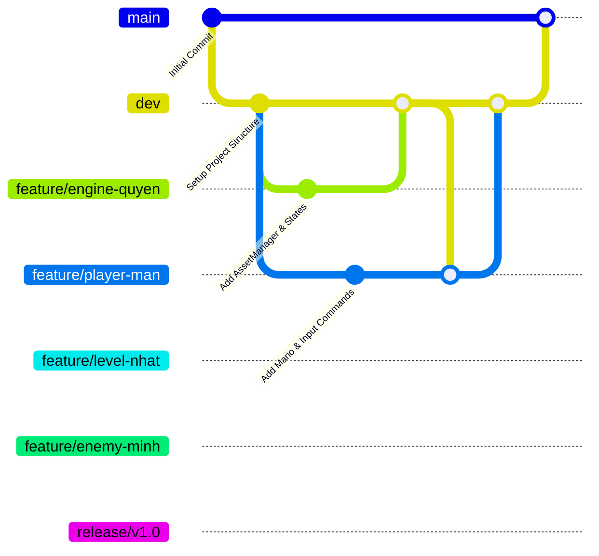

# Kế Hoạch Phát Triển Game 2D Super Mario Bros (C++ / SFML)

Dự án phát triển game 2D Super Mario theo định hướng Lập trình hướng đối tượng (OOP) nâng cao, đáp ứng các tiêu chí chấm điểm và áp dụng **5 Design Patterns** chuẩn mực kiến trúc phần mềm. Kế hoạch này được thiết kế chi tiết dành cho nhóm 4 thành viên: **Phan Quỳnh Quyền**, **Lê Phan Đức Mân**, **Đặng Minh Nhật**, và **Lương Nhật Minh**.

---

## 1. Cấu Trúc Thư Mục Dự Án (Project Folder Structure)

Dưới đây là cấu trúc thư mục chuẩn modular cho dự án C++ (sử dụng SFML hoặc SDL2). Mọi file `.h` và `.cpp` được tổ chức phân lớp rõ ràng để tránh xung đột mã nguồn khi 4 người cùng làm việc trên Git.

```text
SuperMarioGame/
├── assets/                          # Quản lý tài nguyên game
│   ├── textures/                    # Hình ảnh, Spritesheets (mario.png, tileset.png, enemies.png)
│   ├── audio/                       # Âm thanh (jump.wav, coin.wav, BGM.ogg)
│   ├── fonts/                       # Phông chữ (PixelFont.ttf)
│   └── maps/                        # Dữ liệu bản đồ (level1.json, level2.json, level3.json)
├── include/                         # Header files (.h / .hpp)
│   ├── Core/                        # Quản lý vòng lặp game, Asset, Sound & Save
│   │   ├── Game.h
│   │   ├── AssetManager.h
│   │   ├── SoundManager.h
│   │   └── SaveSystem.h
│   ├── States/                      # Quản lý trạng thái màn hình (State Pattern)
│   │   ├── GameState.h
│   │   ├── GameStateManager.h
│   │   ├── MenuState.h
│   │   ├── PlayState.h
│   │   ├── PauseState.h
│   │   └── GameOverState.h
│   ├── Entities/                    # Đối tượng trong game (Inheritance & Polymorphism)
│   │   ├── Entity.h
│   │   ├── Character.h
│   │   ├── Mario.h
│   │   └── Luigi.h
│   │   ├── Enemies/
│   │   │   ├── Enemy.h
│   │   │   ├── Goomba.h
│   │   │   ├── Koopa.h
│   │   │   └── PiranhaPlant.h
│   │   └── Items/
│   │       ├── Item.h
│   │       ├── Mushroom.h
│   │       ├── FireFlower.h
│   │       └── Coin.h
│   ├── PlayerStates/                # Trạng thái nâng cấp của Mario (State Pattern)
│   │   ├── PlayerState.h
│   │   ├── SmallState.h
│   │   ├── SuperState.h
│   │   └── FireState.h
│   ├── Commands/                    # Điều khiển nhân vật (Command Pattern)
│   │   ├── Command.h
│   │   ├── MoveCommand.h
│   │   ├── JumpCommand.h
│   │   └── FireCommand.h
│   ├── Input/
│   │   └── InputHandler.h
│   ├── Level/                       # Quản lý bản đồ & Camera
│   │   ├── Tile.h
│   │   ├── TileMap.h
│   │   ├── Level.h
│   │   └── Camera.h
│   ├── Physics/                     # Xử lý va chạm
│   │   └── CollisionManager.h
│   ├── Factories/                   # Khởi tạo đối tượng tự động (Factory Pattern)
│   │   └── EntityFactory.h
│   ├── Observer/                    # Hệ thống sự kiện (Observer Pattern)
│   │   ├── Observer.h
│   │   ├── Subject.h
│   │   └── Event.h
│   └── UI/                          # Giao diện hiển thị
│       └── HUD.h
├── src/                             # Source files (.cpp) tương ứng với các header
│   ├── main.cpp
│   ├── Core/
│   ├── States/
│   ├── Entities/
│   │   ├── Enemies/
│   │   └── Items/
│   ├── PlayerStates/
│   ├── Commands/
│   ├── Input/
│   ├── Level/
│   ├── Physics/
│   ├── Factories/
│   ├── Observer/
│   └── UI/
├── CMakeLists.txt                   # Cấu hình biên dịch dự án bằng CMake
├── .gitignore                       # Loại bỏ các file tạm (build/, .vs/, *.exe)
└── README.md                        # Hướng dẫn cài đặt và chạy game
```

---

## 2. 5 Design Patterns Áp Dụng Trong Game

Để đạt **trọn vẹn 25/25 điểm Design Patterns** theo bảng tiêu chí, dự án sẽ áp dụng 5 mẫu thiết kế sau:

### 1. Singleton Pattern
* **Vị trí áp dụng:** `AssetManager`, `SoundManager`.
* **Mục đích:** Đảm bảo chỉ có duy nhất 1 instance quản lý việc load và nạp dữ liệu ảnh/âm thanh vào bộ nhớ RAM. Giúp toàn bộ ứng dụng gọi đến tài nguyên mà không cần truyền tham chiếu khắp nơi hay load lặp đi lặp lại file tài nguyên.
* **Minh họa mã nguồn:**
  ```cpp
  class AssetManager {
  private:
      static AssetManager* instance;
      std::map<std::string, sf::Texture> textures;
      AssetManager() {} // Private Constructor
  public:
      static AssetManager* getInstance() {
          if (!instance) instance = new AssetManager();
          return instance;
      }
      void loadTexture(const std::string& name, const std::string& filename);
      sf::Texture& getTexture(const std::string& name);
  };
  ```

### 2. Factory Method Pattern
* **Vị trí áp dụng:** `EntityFactory`.
* **Mục đích:** Khi đọc dữ liệu bản đồ (`level1.json` hoặc `.txt`), thay vì sử dụng các câu lệnh `if-else` chằng chịt để khởi tạo `Goomba`, `Koopa`, `Mushroom`, `Coin`, `EntityFactory` sẽ đứng ra tạo đối tượng động dựa vào mã Tile/Tag.
* **Minh họa mã nguồn:**
  ```cpp
  class EntityFactory {
  public:
      static Entity* createEntity(EntityType type, float x, float y) {
          switch (type) {
              case EntityType::GOOMBA: return new Goomba(x, y);
              case EntityType::KOOPA: return new Koopa(x, y);
              case EntityType::MUSHROOM: return new Mushroom(x, y);
              case EntityType::COIN: return new Coin(x, y);
              default: return nullptr;
          }
      }
  };
  ```

### 3. State Pattern
* **Vị trí áp dụng:** 
  1. `GameStateManager` (`MenuState`, `PlayState`, `PauseState`, `GameOverState`).
  2. `PlayerState` cho Mario (`SmallState`, `SuperState`, `FireState`).
* **Mục đích:** Thay đổi hành vi của đối tượng khi trạng thái của nó thay đổi. Ví dụ: Mario ở dạng `SmallState` khi ăn nấm sẽ biến đổi sang `SuperState` (thay đổi kích thước, hình ảnh spritesheet và khả năng phá vỡ gạch).

### 4. Command Pattern
* **Vị trí áp dụng:** `InputHandler` và các lớp `Command` (`JumpCommand`, `MoveCommand`, `FireCommand`).
* **Mục đích:** Tách biệt việc bắt phím bấm (Keyboard Input) với hành động thực tế của nhân vật. Cho phép dễ dàng đổi phím bấm (Rebinding controls), viết AI tự động điều khiển phím hoặc hỗ trợ 2 người chơi (Mario & Luigi).
* **Minh họa mã nguồn:**
  ```cpp
  class Command {
  public:
      virtual ~Command() {}
      virtual void execute(Character& character) = 0;
  };

  class JumpCommand : public Command {
  public:
      void execute(Character& character) override {
          character.jump();
      }
  };
  ```

### 5. Observer Pattern
* **Vị trí áp dụng:** `Subject`, `Observer`, `HUD` (ScoreManager).
* **Mục đích:** Khi Mario ăn đồng xu, tiêu diệt quái vật hoặc mất mạng, nhân vật sẽ phát ra sự kiện (`notify`). Lớp `HUD` đăng ký nhận tin nhắn sẽ tự động cập nhật số điểm, số coin, và mạng sống trên màn hình mà không cần Mario phải giữ tham chiếu tới HUD.

---

## 3. Phân Chia Công Việc Chi Tiết Cho 4 Thành Viên

| Thành viên | Vai trò chính | Trách nhiệm chi tiết & Công việc cụ thể | File đảm nhận (`include/` & `src/`) |
| :--- | :--- | :--- | :--- |
| **Phan Quỳnh Quyền** | **Engine & Core Architecture** | 1. Xây dựng Game Loop chuẩn (FPS capping ~60 FPS, DeltaTime).<br>2. Cài đặt **Singleton Pattern** cho `AssetManager` & `SoundManager`.<br>3. Cài đặt **State Pattern** cho quản lý màn hình (`GameStateManager`, `MenuState`, `PlayState`, `PauseState`, `GameOverState`).<br>4. Lập trình tính năng Save/Load game (`SaveSystem`) lưu điểm số, level qua file text/binary. | `Core/Game.*`<br>`Core/AssetManager.*`<br>`Core/SoundManager.*`<br>`Core/SaveSystem.*`<br>`States/*` |
| **Lê Phan Đức Mân** | **Player Mechanics & Control** | 1. Xây dựng lớp cơ sở `Character` và 2 lớp derivied `Mario`, `Luigi` (Inheritance/Polymorphism).<br>2. Cài đặt **Command Pattern** (`InputHandler`, `JumpCommand`, `MoveCommand`, `FireCommand`).<br>3. Cài đặt **State Pattern** cho dạng biến hình của Mario (`SmallState`, `SuperState`, `FireState`).<br>4. Vật lý di chuyển nhân vật: gia tốc, trọng lực, nhảy, trượt đất, chạy nhanh. | `Entities/Entity.*`<br>`Entities/Character.*`<br>`Entities/Mario.*`<br>`Entities/Luigi.*`<br>`PlayerStates/*`<br>`Commands/*`<br>`Input/*` |
| **Đặng Minh Nhật** | **Level, Tilemap & Collision** | 1. Cài đặt bộ nạp bản đồ (`TileMap`, `Level`) đọc từ file cấu hình map (`level1.json` / `.txt`). Tối thiểu **3 levels**.<br>2. Xây dựng Camera cuộn (Smooth Scrolling Camera) đi theo nhân vật.<br>3. Xây dựng bộ xử lý va chạm `CollisionManager` (AABB physics): Nhân vật vs Địa hình, Gạch chấm hỏi (`?`), Gạch vỡ, Ống chui.<br>4. Cài đặt **Factory Pattern** (`EntityFactory`) để đọc map và tự động sinh quái/vật phẩm. | `Level/Tile.*`<br>`Level/TileMap.*`<br>`Level/Level.*`<br>`Level/Camera.*`<br>`Physics/CollisionManager.*`<br>`Factories/EntityFactory.*` |
| **Lương Nhật Minh** | **Enemies AI, Items & UI** | 1. Xây dựng cây phân cấp Quái vật: `Enemy` -> `Goomba`, `Koopa`, `PiranhaPlant`. Lập trình AI di chuyển qua lại, phát hiện vực thẫm, xoay mai rùa Koopa.<br>2. Xây dựng cây phân cấp Vật phẩm: `Item` -> `Mushroom`, `FireFlower`, `Coin`. Quản lý logic xuất hiện từ gạch.<br>3. Cài đặt **Observer Pattern** kết nối sự kiện Game với màn hình hiển thị.<br>4. Xây dựng giao diện `HUD` (điểm số, số coin, thời gian còn lại, số mạng sống). | `Entities/Enemies/*`<br>`Entities/Items/*`<br>`Observer/*`<br>`UI/HUD.*` |

---

## 4. Quy Trình Làm Việc Phân Nhánh Trên GitHub (Git Workflow)

Để nhóm 4 người làm việc mượt mà, không bao giờ bị đè code (conflict) lẫn nhau, nhóm sẽ áp dụng quy trình **Git Flow / Feature Branch Workflow**:



### Các Bước Thực Hiện Chi Tiết trên Git:

1. **Khởi tạo Repo chính (Quyền thực hiện):**
   * Quyền tạo repo trên GitHub, đẩy cấu trúc thư mục mẫu lên branch `main`.
   * Tạo branch `dev` từ `main`. Branch `dev` sẽ là nơi hợp nhất code của cả 4 người.

2. **Quy tắc phân nhánh cho từng thành viên:**
   Mỗi thành viên khi làm nhiệm vụ của mình sẽ checkout từ branch `dev` ra branch riêng:
   * Quyền: `git checkout -b feature/core-engine`
   * Mân: `git checkout -b feature/player-mechanics`
   * Nhật: `git checkout -b feature/level-collision`
   * Minh: `git checkout -b feature/enemy-items-hud`

3. **Quy trình đẩy Code & Pull Request (PR):**
   * **Bước 1:** Trước khi bắt đầu làm mỗi ngày, kéo code mới nhất từ `dev` về branch của mình:
     ```bash
     git checkout dev
     git pull origin dev
     git checkout feature/ten-nhanh-cua-ban
     git merge dev
     ```
   * **Bước 2:** Lập trình và commit thường xuyên với message rõ ràng:
     ```bash
     git add .
     git commit -m "feat(mario): implement jump physics and command pattern"
     ```
   * **Bước 3:** Đẩy branch lên GitHub và tạo **Pull Request (PR)** vào branch `dev`:
     ```bash
     git push origin feature/ten-nhanh-cua-ban
     ```
   * **Bước 4 (Code Review):** Cần ít nhất **1 thành viên khác** duyệt PR (Review & Approve) trước khi được Merge vào `dev`. Không ai tự tiện push trực tiếp lên `main` hay `dev`.

---

## 5. Kế Hoạch Kiểm Thử & Kiểm Tra (Verification Plan)

### Automated Build & Compilation Check
* Tạo `CMakeLists.txt` tiêu chuẩn để tất cả 4 thành viên đều có thể biên dịch dễ dàng trên Visual Studio hoặc CLion/VSCode.
* Đảm bảo project biên dịch thành công không có Warning/Error.

### Manual Verification Matrix
1. **Kiểm tra Nhân vật & Điều khiển (Mân & Quyền):**
   - Chạy game, bấm mũi tên/WASD xem Mario di chuyển mượt mà không.
   - Nhấn Space/Z để nhảy, kiểm tra nhảy cao/thấp theo lực giữ phím.
   - Ăn nấm biến to (`SuperState`), ăn hoa biến thành `FireState` bắn đạn.
2. **Kiểm tra Map & Va chạm (Nhật):**
   - Di chuyển qua 3 Levels khác nhau.
   - Mario va chạm với đất, tường, nhảy đập đầu vào gạch chấm hỏi xem item có nảy lên không.
3. **Kiểm tra AI & Items (Minh):**
   - Giẫm lên Goomba xem Goomba có bẹp xuống và biến mất không.
   - Đập Koopa xem mai rùa có trượt đi tiêu diệt quái khác không.
   - Cập nhật số điểm & số coin trên thanh HUD thông qua Observer.
