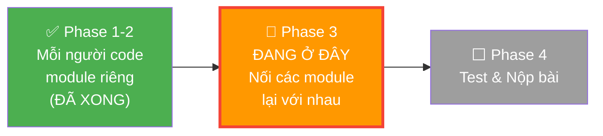
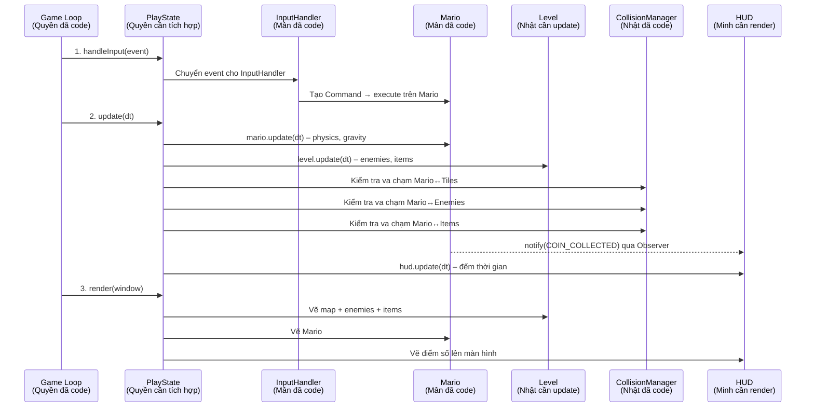
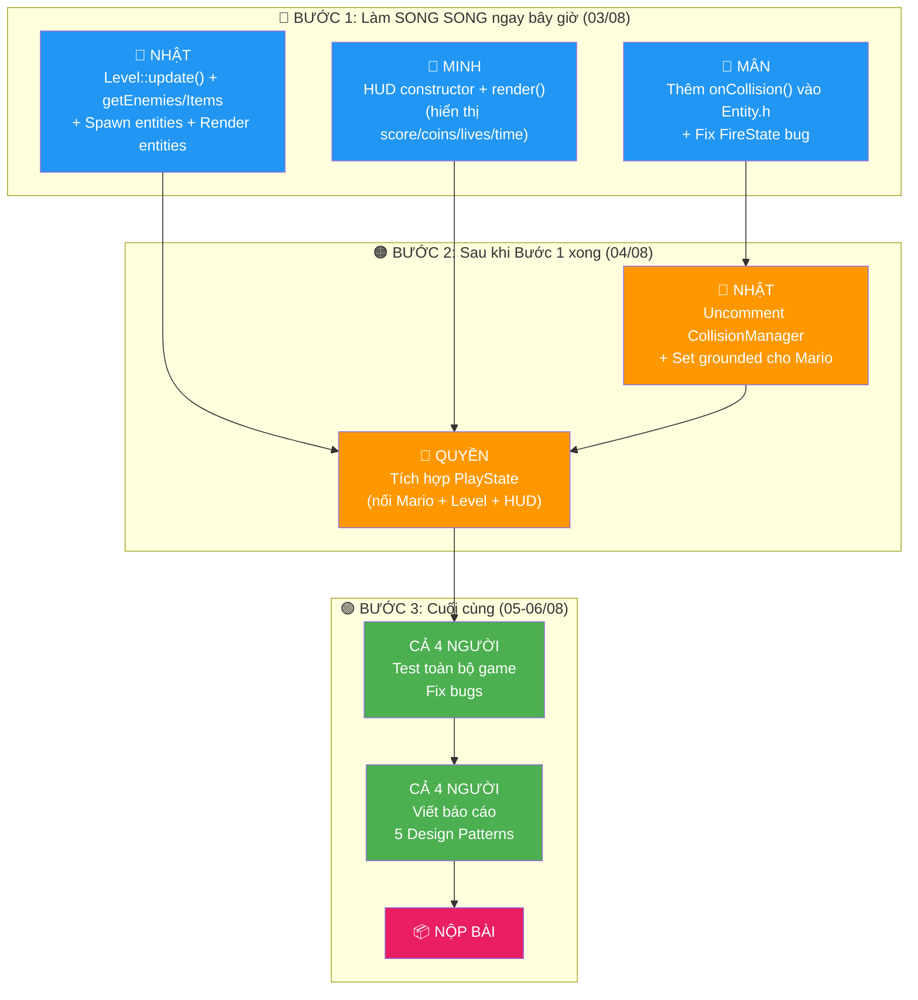

# 📋 Báo Cáo Nhiệm Vụ Chi Tiết – Super Mario Bros 2D (C++/SFML)

> **Ngày cập nhật:** 03/08/2026  
> **Dựa trên:** Phân tích source code thực tế của project  
> **Mục đích:** Mô tả chi tiết, rõ ràng từng nhiệm vụ của mỗi thành viên – bao gồm **ý tưởng**, **cách làm**, và **ý nghĩa** của từng phần công việc.

---

## 📊 Tổng Quan: Game Đang Ở Đâu Và Cần Gì Tiếp Theo?

### Hình dung tổng thể

Hiện tại, game của chúng ta giống như **một ngôi nhà đã xây xong phòng, nhưng chưa lắp cửa nối các phòng lại**:

- **Mario** đã biết đi, nhảy, biến hình (Mân đã code xong) → nhưng **chưa được đặt vào game**
- **Map** đã hiển thị đẹp, camera cuộn mượt (Nhật đã code xong) → nhưng **chưa có quái vật và vật phẩm xuất hiện**
- **Goomba, Koopa, Coin** đã biết di chuyển và animation (Minh đã code xong) → nhưng **chưa được spawn lên map**
- **HUD** đã biết đếm điểm khi nhận event (Minh đã code xong) → nhưng **chưa hiển thị lên màn hình**
- **Menu, Pause, Game Over** đã hiển thị đẹp (Quyền đã code xong) → nhưng **PlayState** (màn hình chơi game) vẫn chỉ là **trình xem bản đồ**



### Nhiệm vụ cốt lõi còn lại: **TÍCH HỢP**

Tất cả các module đã hoạt động riêng lẻ. Bây giờ cần **nối chúng lại** trong `PlayState` – nơi gameplay thực sự diễn ra. Hình dung `PlayState` như **sân khấu chính** của game: nó là nơi Mario xuất hiện, chạy nhảy trên map, giẫm quái, ăn nấm, và điểm số hiện lên màn hình.

---

## 🔄 Vòng Đời Một Frame Game – Ai Làm Gì?

Để hiểu nhiệm vụ của mỗi người, trước hết hãy hiểu **chuyện gì xảy ra trong 1 frame** (1/60 giây) khi game chạy:



**Giải thích sơ đồ trên:**

1. **handleInput** – Người chơi bấm phím → `InputHandler` (Mân) dịch thành lệnh → Mario thực hiện (đi, nhảy, bắn)
2. **update** – Mỗi frame, tất cả object tự cập nhật vị trí, vật lý, animation. Sau đó kiểm tra va chạm.
3. **render** – Vẽ mọi thứ lên màn hình theo thứ tự: map → enemies → items → Mario → HUD

> **Ai chịu trách nhiệm gì trong sơ đồ này?**
> - **Quyền** viết code `PlayState` gọi tất cả các bước trên theo đúng thứ tự
> - **Mân** đã code sẵn Mario + InputHandler, chỉ cần đảm bảo API đúng
> - **Nhật** cần bổ sung `Level::update()` để enemies/items hoạt động
> - **Minh** cần bổ sung `HUD::render()` để hiển thị điểm số

---

## 🔍 So Sánh: Tài Liệu Cũ Ghi Gì vs Thực Tế Code Thế Nào

Trước khi đi vào nhiệm vụ chi tiết, cần hiểu rõ **tài liệu cũ (`detailed_task_guide.md`) đã lỗi thời** ở nhiều chỗ. Nhiều file mà tài liệu ghi "STUB/EMPTY" thực tế đã được implement đầy đủ:

| Module | Tài liệu cũ nói gì | Source code thực tế | Kết luận |
|--------|--------------------|--------------------|----------|
| MenuState | ❌ "STUB – onEnter, update, render đều empty" | ✅ **266 dòng code** – có title, background image, START GAME/EXIT, selector animation, keyboard navigation | **Sai – đã xong** |
| PauseState | ❌ "STUB – đều empty" | ✅ **153 dòng code** – overlay đen bán trong suốt, RESUME/QUIT TO MENU, selector, Escape shortcut | **Sai – đã xong** |
| GameOverState | ❌ "STUB – đều empty" | ✅ **112 dòng code** – GAME OVER text, score, TRY AGAIN/MAIN MENU options | **Sai – đã xong** (còn thiếu navigation Up/Down) |
| main.cpp | ⚠️ "Sandbox mode – không gọi Game::run()" | ✅ **Đã fix** – `Game game; game.run();` | **Sai – đã xong** |
| Coin.cpp | ❌ "update(dt) empty – không có animation" | ✅ **111 dòng code** – spin animation 3D, pop animation, fallback render | **Sai – đã xong** |
| FireFlower.cpp | ❌ "update(dt) empty – không có animation" | ✅ **112 dòng code** – emerge từ gạch, bob animation, fallback render hoa lửa | **Sai – đã xong** |
| Mushroom.cpp | ⚠️ "Chưa có quay đầu" | ✅ **Đã có** `reverseDirection()` (dòng 112-114) | **Sai – đã có** |
| PlayState | ❌ "Tất cả methods đều empty" | ⚠️ **Có code** nhưng chỉ là **level camera viewer** – WASD di chuyển camera, chưa có Mario/gameplay | **Đúng một phần – cần tích hợp gameplay** |
| HUD.cpp | ❌ "Constructor empty, render empty" | ⚠️ `onNotify()` và `update()` **đã có logic**, nhưng constructor empty + `render()` vẫn **chỉ có 1 dòng comment** | **Đúng – cần implement render** |
| Level::update() | ⚠️ "Empty" | ❌ **Vẫn empty** `void Level::update(float dt) {}` | **Đúng – cần implement** |
| CollisionManager entity | ⚠️ "Code bị comment out" | ❌ **Vẫn comment out** – thiếu `onCollision()` trong Entity.h | **Đúng – cần implement** |

---

## 👤 PHAN QUỲNH QUYỀN – Engine & Core Architecture

### Những gì Quyền ĐÃ hoàn thành

Quyền đã code xong **toàn bộ hệ thống nền tảng** của game:

- **Game Loop** (`Game.cpp`): vòng lặp chính chạy 60 FPS, xử lý event, gọi update, gọi render – giống như "trái tim" bơm máu cho cả game
- **AssetManager** (Singleton): quản lý tải hình ảnh, font, âm thanh – chỉ tải 1 lần, dùng mãi
- **SoundManager** (Singleton): phát nhạc nền và hiệu ứng âm thanh
- **SaveSystem**: lưu/đọc tiến trình game (score, coins, lives, level) từ file
- **GameStateManager**: quản lý stack các màn hình (Menu → Play → Pause → GameOver)
- **MenuState**: màn hình chính với title "SUPER MARIO BROS", background, START GAME/EXIT
- **PauseState**: overlay đen bán trong suốt, RESUME/QUIT TO MENU
- **GameOverState**: hiển thị GAME OVER, điểm số, TRY AGAIN/MAIN MENU

### 🔴 NHIỆM VỤ CHÍNH: Biến PlayState Từ "Trình Xem Bản Đồ" Thành "Gameplay Thực Sự"

#### Vấn đề hiện tại là gì?

Hiện tại, khi người chơi bấm START GAME từ Menu, game chuyển sang `PlayState`. Nhưng `PlayState` **chỉ hiển thị bản đồ** và cho phép dùng WASD để **kéo camera** như Google Maps – không có Mario, không có quái, không có gameplay gì cả.

Đây là code hiện tại của `PlayState::update()`:

```cpp
// HIỆN TẠI: PlayState chỉ là trình xem bản đồ
void PlayState::update(float dt) {
    // Dùng phím mũi tên để kéo camera sang trái/phải/trên/dưới
    if (sf::Keyboard::isKeyPressed(sf::Keyboard::Right))
        cam.move(speed, 0.f);
    // ... tương tự cho Left, Up, Down
    level.update(dt);  // Level::update() hiện cũng empty
}
```

#### Quyền cần biến đổi PlayState thành gì?

Quyền cần **thay thế logic kéo camera** bằng **gameplay loop thực sự**. Sau khi sửa, `PlayState` phải làm được:

1. **Tạo Mario** và đặt vào vị trí đầu level khi bắt đầu chơi
2. **Nhận input từ người chơi** → dịch thành lệnh điều khiển Mario
3. **Cập nhật tất cả đối tượng** mỗi frame (Mario di chuyển, quái đi qua lại, coin xoay)
4. **Kiểm tra va chạm** (Mario chạm đất? Mario giẫm quái? Mario ăn nấm?)
5. **Camera tự theo Mario** thay vì người chơi kéo thủ công
6. **Vẽ mọi thứ** lên màn hình theo đúng thứ tự

#### Quyền cần phối hợp với ai?

```
                    ┌─────────────────────────────────┐
                    │  PlayState (QUYỀN viết)          │
                    │  = "Sân khấu" kết nối tất cả    │
                    └──────────┬──────────────────────┘
                               │
          ┌────────────────────┼────────────────────┐
          │                    │                    │
    ┌─────▼─────┐      ┌──────▼──────┐     ┌──────▼──────┐
    │ MÂN cung  │      │ NHẬT cung   │     │ MINH cung   │
    │ cấp Mario │      │ cấp Level   │     │ cấp HUD     │
    │ + Input   │      │ + Collision  │     │ hiển thị    │
    └───────────┘      └─────────────┘     └─────────────┘
```

**Quyền CẦN ĐỢI** 3 người hoàn thành phần của họ trước khi bắt tay vào, vì PlayState là nơi **gọi code của cả 3 người**.

---

#### Chi tiết việc 1: Thêm các thành phần gameplay vào PlayState

**Ý tưởng:** PlayState hiện chỉ có 1 biến `Level level`. Quyền cần thêm Mario, InputHandler, HUD – giống như đạo diễn cần thêm diễn viên, kịch bản, bảng điểm lên sân khấu.

**File cần sửa:** [PlayState.h](file:///c:/SuperMarioGame/include/States/PlayState.h)

**Hiện tại** chỉ có:
```cpp
class PlayState : public GameState {
private:
    Level level;   // ← Chỉ có bản đồ, thiếu mọi thứ khác
};
```

**Cần thêm thành:**
```cpp
class PlayState : public GameState {
private:
    Level level;                         // Bản đồ (Nhật đã code)
    
    // ★ THÊM MỚI: "Diễn viên chính" ★
    std::unique_ptr<Mario> mario;        // Nhân vật người chơi điều khiển (Mân đã code)
    
    // ★ THÊM MỚI: "Bộ phận đạo diễn" ★  
    InputHandler inputHandler;           // Bộ dịch phím bấm → hành động Mario (Mân đã code)
    
    // ★ THÊM MỚI: "Bảng điểm" ★
    HUD hud;                            // Hiển thị score, coins, lives, time (Minh đang code)
    
    bool isGameOver = false;             // Cờ đánh dấu game đã kết thúc chưa
};
```

**Tại sao dùng `std::unique_ptr<Mario>` thay vì `Mario mario`?**
→ Vì Mario là đối tượng phức tạp, có thể cần tạo lại khi restart level. `unique_ptr` cho phép tạo/huỷ Mario linh hoạt mà không cần lo quản lý bộ nhớ.

---

#### Chi tiết việc 2: Khởi tạo gameplay khi vào PlayState

**Ý tưởng:** Khi người chơi bấm START GAME từ Menu, game gọi `PlayState::onEnter()`. Đây là lúc chuẩn bị mọi thứ trước khi gameplay bắt đầu – giống như **setup sân khấu trước khi mở màn**.

**File cần sửa:** [PlayState.cpp](file:///c:/SuperMarioGame/src/States/PlayState.cpp) – hàm `onEnter()`

**Ý nghĩa từng bước trong `onEnter()`:**

```cpp
void PlayState::onEnter() {
    // ═══════════════════════════════════════════════════
    // BƯỚC 1: TẢI BẢN ĐỒ
    // ═══════════════════════════════════════════════════
    // Đọc file bản đồ level 1-1 từ ổ cứng vào RAM.
    // File "1-1.txt" chứa lưới ký tự, mỗi ký tự = 1 ô tile (gạch, đất, ống, v.v.)
    // Code này NHẬT đã viết sẵn, Quyền chỉ cần gọi.
    if (!level.loadLevel("1.1/1-1.txt")) {
        std::cerr << "[PlayState] Không thể tải bản đồ!" << std::endl;
    }

    // ═══════════════════════════════════════════════════
    // BƯỚC 2: THIẾT LẬP CAMERA
    // ═══════════════════════════════════════════════════
    // Camera = "cửa sổ nhìn" vào thế giới game.
    // Thế giới game rộng hàng ngàn pixel, nhưng màn hình chỉ 800×600.
    // Camera chỉ hiện 1 phần nhỏ, và sẽ di theo Mario.
    Camera& cam = level.getCamera();
    cam.setSize(400.f, 225.f);                    // Kích thước vùng nhìn
    cam.setLevelBounds(244.f * 16.f, 16.f * 16.f); // Giới hạn camera = kích thước map

    // ═══════════════════════════════════════════════════
    // BƯỚC 3: TẠO MARIO (nhân vật chính)
    // ═══════════════════════════════════════════════════
    // Đây là lúc "đặt diễn viên chính lên sân khấu".
    // Mario() constructor đã được MÂN code: tự động set tốc độ đi, nhảy,
    // trọng lực, và bắt đầu ở trạng thái SmallState (Mario nhỏ).
    mario = std::make_unique<Mario>();
    mario->setPosition(48.f, 192.f);  // Vị trí xuất phát: gần đầu level, trên mặt đất
    
    // ═══════════════════════════════════════════════════
    // BƯỚC 4: KẾT NỐI MARIO VỚI HUD (Observer Pattern)
    // ═══════════════════════════════════════════════════
    // Đây là phần QUAN TRỌNG cho Design Pattern.
    // Giải thích: Mario kế thừa Subject (có addObserver, notify).
    //             HUD kế thừa Observer (có onNotify).
    // Khi gọi addObserver(&hud), ta "đăng ký" HUD lắng nghe Mario.
    // Từ giờ, mỗi khi Mario ăn coin → Mario gọi notify(COIN_COLLECTED)
    //   → HUD tự động nhận event → tăng số coin + cộng điểm.
    // Mario KHÔNG CẦN BIẾT HUD tồn tại → đây là sức mạnh của Observer Pattern.
    mario->addObserver(&hud);
    
    // ═══════════════════════════════════════════════════
    // BƯỚC 5: CAMERA NHÌN VÀO MARIO
    // ═══════════════════════════════════════════════════
    cam.setCenter(mario->getPosition().x, mario->getPosition().y);
}
```

---

#### Chi tiết việc 3: Xử lý input người chơi

**Ý tưởng:** Mỗi khi người chơi bấm/thả phím, SFML tạo ra 1 `sf::Event`. PlayState nhận event này và quyết định phải làm gì. Có 2 loại input:
- **Event-based** (bấm 1 lần): Escape → mở Pause, H → vào underground  
- **Polling-based** (giữ phím): giữ mũi tên phải → Mario chạy liên tục

**File cần sửa:** [PlayState.cpp](file:///c:/SuperMarioGame/src/States/PlayState.cpp) – hàm `handleInput()`

```cpp
void PlayState::handleInput(sf::Event& event, sf::RenderWindow& window) {
    // handleInput() được gọi cho MỖI event riêng lẻ (bấm phím, thả phím, v.v.)
    
    if (event.type == sf::Event::KeyPressed) {
        if (event.key.code == sf::Keyboard::Escape) {
            // Bấm Escape → "đẩy" PauseState lên trên PlayState
            // PlayState VẪN CÒN trong stack (không bị huỷ)
            // Khi Resume, PauseState bị pop ra → PlayState lộ lại → game tiếp tục
            if (stateManager) {
                stateManager->pushState(std::make_unique<PauseState>());
            }
        }
        // GIỮ LẠI: chuyển map underground (U/H) và overworld (M/1)
        // để debug/test
    }
    
    // LƯU Ý: Điều khiển Mario (mũi tên, Space nhảy) KHÔNG xử lý ở đây.
    // Chúng được xử lý trong update() bởi InputHandler (polling-based).
    // Lý do: di chuyển cần kiểm tra LIÊN TỤC mỗi frame (giữ phím = đi liên tục),
    // còn handleInput() chỉ nhận EVENT rời rạc (bấm/thả 1 lần).
}
```

---

#### Chi tiết việc 4: Update gameplay mỗi frame (PHẦN QUAN TRỌNG NHẤT)

**Ý tưởng:** `update(float dt)` được gọi **60 lần mỗi giây**. `dt` (delta time) = thời gian thực tế của frame trước (~0.0167 giây). Mọi thứ trong game cập nhật ở đây: Mario di chuyển, quái đi, coin xoay, va chạm kiểm tra, camera theo dõi.

Hãy hình dung `update()` như **1 "nhịp tim"** của game – mỗi nhịp, tất cả đối tượng sống 1 khoảnh khắc ngắn.

**File cần sửa:** [PlayState.cpp](file:///c:/SuperMarioGame/src/States/PlayState.cpp) – hàm `update()`

```cpp
void PlayState::update(float dt) {
    // Nếu game đã kết thúc, không update gì nữa
    if (isGameOver) return;
    
    // ═══════════════════════════════════════════════════
    // BƯỚC 1: XỬ LÝ ĐIỀU KHIỂN NHÂN VẬT
    // ═══════════════════════════════════════════════════
    // InputHandler (MÂN đã code) kiểm tra phím nào đang được GIỮ
    // và tạo ra Command tương ứng:
    //   - Giữ phím Phải  → MoveRightCommand → gọi mario.moveRight(dt)
    //   - Giữ phím Trái  → MoveLeftCommand  → gọi mario.moveLeft(dt)
    //   - Bấm Space       → JumpCommand     → gọi mario.jump()
    //   - Bấm phím bắn   → FireCommand      → gọi mario.useSpecialAbility()
    // Đây là Command Pattern: phím bấm → Command object → Character action
    inputHandler.handleInput(*mario, dt);
    
    // ═══════════════════════════════════════════════════
    // BƯỚC 2: CẬP NHẬT MARIO
    // ═══════════════════════════════════════════════════
    // mario->update(dt) làm RẤT NHIỀU thứ bên trong (MÂN đã code):
    //   a) Áp dụng trọng lực: velocity.y += gravity * dt (Mario rơi xuống)
    //   b) Áp dụng vận tốc: position += velocity * dt (Mario di chuyển)
    //   c) Xử lý giảm tốc: nếu không giữ phím, Mario chậm dần (trượt nhẹ)
    //   d) Cập nhật PlayerEffects (bất tử sau khi bị đánh, Star, Shield)
    //   e) Cập nhật trạng thái animation (đi, nhảy, đứng yên)
    mario->update(dt);
    
    // ═══════════════════════════════════════════════════
    // BƯỚC 3: VA CHẠM MARIO VỚI ĐỊA HÌNH (TILEMAP)
    // ═══════════════════════════════════════════════════
    // Sau khi Mario di chuyển (Bước 2), kiểm tra xem Mario có chui vào
    // tường/đất không. Nếu có, đẩy Mario ra ngoài.
    // 
    // Cách hoạt động (NHẬT đã code):
    //   1. Lấy hitbox Mario (hình chữ nhật bao quanh)
    //   2. Tìm tất cả tile gần Mario
    //   3. Kiểm tra overlap giữa Mario và mỗi tile solid
    //   4. Nếu overlap: đẩy Mario ra theo trục ngắn nhất
    //      - Overlap ngang < dọc → đẩy sang trái/phải (chạm tường)
    //      - Overlap dọc < ngang → đẩy lên/xuống (đáp đất hoặc đập đầu)
    CollisionManager::resolveTileCollisions(*mario, level.getTileMap());
    
    // ═══════════════════════════════════════════════════
    // BƯỚC 4: CẬP NHẬT LEVEL (ENEMIES + ITEMS)
    // ═══════════════════════════════════════════════════
    // level.update(dt) sẽ:
    //   a) Duyệt tất cả enemies → gọi enemy->update(dt) → quái di chuyển
    //   b) Duyệt tất cả items → gọi item->update(dt) → coin xoay, nấm trượt
    //   c) Va chạm quái/items với TileMap → quái quay đầu khi chạm tường
    //   d) Dọn dẹp: xoá entity đã chết khỏi danh sách
    //
    // ⚠️ CẦN NHẬT implement hàm này (hiện đang empty)
    level.update(dt);
    
    // ═══════════════════════════════════════════════════
    // BƯỚC 5: VA CHẠM MARIO VỚI QUÁI VẬT
    // ═══════════════════════════════════════════════════
    // Duyệt từng enemy, kiểm tra hitbox Mario có chạm hitbox enemy không.
    // Nếu chạm, phải phân biệt 2 trường hợp:
    //
    //   CAS 1: Mario GIẪM từ trên xuống (velocity.y > 0 = đang rơi,
    //          và đáy Mario chưa vượt quá đỉnh enemy)
    //          → Enemy bị tiêu diệt (onStomped)
    //          → Mario nảy lên (velocity.y = -200)
    //          → Gửi event ENEMY_DEFEATED → HUD cộng 100 điểm
    //
    //   CAS 2: Mario chạm NGANG (chạy vào enemy)
    //          → Mario bị damage (takeDamage)
    //          → Nếu Super/Fire → xuống 1 cấp
    //          → Nếu Small → chết
    //
    // ⚠️ CẦN NHẬT expose level.getEnemies()
    for (auto& enemy : level.getEnemies()) {
        if (!enemy || !enemy->isActive()) continue;
        sf::FloatRect overlap;
        if (CollisionManager::checkAABB(mario->getBounds(), enemy->getBounds(), overlap)) {
            // Kiểm tra: Mario đang rơi xuống VÀ đáy Mario gần đỉnh enemy?
            bool stompedFromAbove = 
                mario->getVelocity().y > 0 &&
                mario->getBounds().top + mario->getBounds().height 
                    < enemy->getBounds().top + 10.f;
            
            if (stompedFromAbove) {
                enemy->onStomped();                    // Quái bị giẫm
                mario->setVelocity(mario->getVelocity().x, -200.f);  // Mario nảy
                mario->notify(GameEvent{GameEventType::ENEMY_DEFEATED, 100}); // +100 điểm
            } else {
                mario->takeDamage();   // Mario bị thương
            }
        }
    }
    
    // ═══════════════════════════════════════════════════
    // BƯỚC 6: VA CHẠM MARIO VỚI VẬT PHẨM
    // ═══════════════════════════════════════════════════
    // Khi Mario chạm coin/mushroom/fire flower:
    //   - Gọi item->onCollect() → item biến mất
    //   - Gửi event cho HUD cập nhật (COIN_COLLECTED, POWERUP_COLLECTED)
    //   - Nếu là Mushroom: Mario chuyển từ Small → Super (Mân đã code logic này)
    //   - Nếu là FireFlower: Mario chuyển từ Super → Fire
    //
    // ⚠️ CẦN NHẬT expose level.getItems()
    for (auto& item : level.getItems()) {
        if (!item || !item->isActive()) continue;
        sf::FloatRect overlap;
        if (CollisionManager::checkAABB(mario->getBounds(), item->getBounds(), overlap)) {
            item->onCollect();
            mario->notify(GameEvent{GameEventType::COIN_COLLECTED, 200});
            // TODO: Phân biệt loại item (Coin vs Mushroom vs FireFlower)
            //       để gửi đúng event type và áp dụng power-up
        }
    }
    
    // ═══════════════════════════════════════════════════
    // BƯỚC 7: CAMERA TỰ THEO MARIO
    // ═══════════════════════════════════════════════════
    // Thay vì kéo camera bằng WASD (code cũ), camera giờ tự bám theo
    // vị trí Mario. Camera.h (NHẬT đã code) có logic smooth tracking
    // và boundary clamping (không vượt quá mép map).
    Camera& cam = level.getCamera();
    cam.update(mario->getPosition());
    
    // ═══════════════════════════════════════════════════
    // BƯỚC 8: CẬP NHẬT HUD
    // ═══════════════════════════════════════════════════
    // hud.update(dt) đếm ngược thời gian còn lại (400 → 0).
    // Score và coins đã được tự cập nhật qua Observer Pattern (Bước 5, 6).
    hud.update(dt);
    
    // ═══════════════════════════════════════════════════
    // BƯỚC 9: KIỂM TRA MARIO CHẾT
    // ═══════════════════════════════════════════════════
    // Mario chết khi:
    //   a) Rơi xuống hố (position.y > chiều cao map + buffer)
    //   b) Hết mạng sau khi takeDamage ở Small state
    // Khi chết → chuyển sang GameOverState hiển thị điểm số cuối
    float mapBottomY = level.getTileMap().getMapHeight() * 16.f;
    if (mario->getPosition().y > mapBottomY + 100.f) {
        mario->die(DeathCause::Void);
        isGameOver = true;
        if (stateManager) {
            stateManager->changeState(std::make_unique<GameOverState>(0));
        }
    }
}
```

---

#### Chi tiết việc 5: Vẽ gameplay lên màn hình

**Ý tưởng:** `render()` được gọi sau `update()`, vẽ trạng thái hiện tại lên cửa sổ. Thứ tự vẽ **RẤT QUAN TRỌNG**: vẽ sau = nằm trên.

```cpp
void PlayState::render(sf::RenderWindow& window) {
    Camera& cam = level.getCamera();
    
    // ═══════════════════════════════════════════════════
    // BƯỚC 1: ÁP DỤNG CAMERA
    // ═══════════════════════════════════════════════════
    // Nói cho SFML biết "chỉ vẽ phần thế giới mà camera đang nhìn".
    // Nếu không có bước này, SFML sẽ vẽ từ góc (0,0) – chỉ thấy
    // góc trái trên cùng của map, bất kể Mario ở đâu.
    cam.applyTo(window);
    
    // ═══════════════════════════════════════════════════
    // BƯỚC 2: XÓA MÀN HÌNH VỚI MÀU NỀN
    // ═══════════════════════════════════════════════════
    // Overworld: trời xanh (92, 148, 252) – màu kinh điển Mario
    // Underground: đen
    bool isUndergroundArea = level.getIsUnderground();
    sf::Color bgColor = isUndergroundArea ? sf::Color::Black : sf::Color(92, 148, 252);
    window.clear(bgColor);
    
    // ═══════════════════════════════════════════════════
    // BƯỚC 3: VẼ MAP (nền, gạch, ống, gạch chấm hỏi)
    // ═══════════════════════════════════════════════════
    // level.render() vẽ tilemap + enemies + items (SAU KHI NHẬT bổ sung)
    level.render(window);
    
    // ═══════════════════════════════════════════════════
    // BƯỚC 4: VẼ MARIO
    // ═══════════════════════════════════════════════════
    // Mario được vẽ SAU map để nằm TRÊN nền đất/gạch.
    // mario->render() vẽ sprite tại position hiện tại.
    if (mario) mario->render(window);
    
    // ═══════════════════════════════════════════════════
    // BƯỚC 5: VẼ HUD (điểm số, coins, lives, time)
    // ═══════════════════════════════════════════════════
    // QUAN TRỌNG: Reset về default view TRƯỚC khi vẽ HUD.
    // Lý do: HUD phải CỐ ĐỊNH trên màn hình (luôn ở góc trên),
    // không bị camera kéo đi. Nếu không reset view, khi camera
    // di chuyển theo Mario, HUD cũng trôi theo → người chơi
    // không thấy điểm số.
    window.setView(window.getDefaultView());
    hud.render(window);   // ⚠️ CẦN MINH implement
}
```

---

#### Việc phụ: Hoàn thiện GameOverState (Up/Down navigation)

**Vấn đề:** GameOverState có 2 lựa chọn TRY AGAIN / MAIN MENU, nhưng `handleInput()` chỉ xử lý Enter → quay Menu. Chưa có phím Up/Down để chuyển giữa 2 lựa chọn, và TRY AGAIN chưa hoạt động.

**Cách sửa:** Copy logic keyboard navigation từ PauseState (đã code đúng) sang GameOverState, thêm xử lý TRY AGAIN tạo PlayState mới.

**File:** [GameOverState.cpp](file:///c:/SuperMarioGame/src/States/GameOverState.cpp) – hàm `handleInput()` và `update()`

```cpp
// Sửa handleInput() – thêm Up/Down và TRY AGAIN:
void GameOverState::handleInput(sf::Event& event, sf::RenderWindow& window) {
    if (event.type == sf::Event::KeyPressed) {
        switch (event.key.code) {
            case sf::Keyboard::Up:
            case sf::Keyboard::W:
                // Di chuyển lên trong danh sách menu
                selectedIndex--;
                if (selectedIndex < 0) selectedIndex = 1; // Wrap around
                updateSelectorPosition();
                break;
            case sf::Keyboard::Down:
            case sf::Keyboard::S:
                // Di chuyển xuống
                selectedIndex++;
                if (selectedIndex > 1) selectedIndex = 0;
                updateSelectorPosition();
                break;
            case sf::Keyboard::Enter:
                if (stateManager) {
                    if (selectedIndex == 0) {
                        // TRY AGAIN → tạo PlayState mới, chơi lại từ đầu
                        stateManager->changeState(std::make_unique<PlayState>());
                    } else {
                        // MAIN MENU → quay về màn hình chính
                        stateManager->changeState(std::make_unique<MenuState>());
                    }
                }
                break;
            default: break;
        }
    }
}

// Sửa update() – thêm animation nhấp nháy selector:
void GameOverState::update(float dt) {
    blinkTimer += dt;
    if (blinkTimer >= 0.4f) {
        showSelector = !showSelector;
        blinkTimer = 0.f;
    }
}
```

---

#### Tóm tắt toàn bộ việc của Quyền

```
 THỨ TỰ ƯU TIÊN                  TRẠNG THÁI      PHỤ THUỘC
 ──────────────────────────────── ──────────────── ─────────────────────
 1. Tích hợp PlayState gameplay   🔴 Cần làm      Đợi Nhật + Minh + Mân
    → Thêm Mario, InputHandler,
      HUD vào PlayState.h
    → Viết lại onEnter(), update(),
      render(), handleInput()
      
 2. Fix GameOverState navigation  🟡 Thiếu logic  Không phụ thuộc ai
    → Thêm Up/Down cho TRY AGAIN
    
 3. Viết báo cáo Singleton +      🟢 Chưa viết    Không phụ thuộc ai
    State Pattern (GameStateManager)
    
 4. Test game flow: Menu → Play   🟢 Cuối cùng    Sau khi mọi thứ xong
    → Pause → Resume → GameOver
    → TRY AGAIN / MAIN MENU
```

---

## 👤 LÊ PHAN ĐỨC MÂN – Player Mechanics & Control

### Những gì Mân ĐÃ hoàn thành

Mân đã code xong **TOÀN BỘ hệ thống nhân vật**, bao gồm:

- **Entity** (lớp cơ sở): position, velocity, sprite, bounds – mọi đối tượng trong game đều kế thừa từ đây
- **Character** (lớp trung gian): vật lý di chuyển (gia tốc, giảm tốc, trọng lực, nhảy), quản lý PlayerState và PlayerEffects
- **Mario** (lớp cụ thể): profile riêng (walkSpeed=170, runSpeed=260, jumpForce=350)
- **Luigi** (lớp cụ thể): profile riêng (nhảy cao hơn, đi chậm hơn Mario)
- **Command Pattern**: JumpCommand, MoveCommand, FireCommand + InputHandler
- **State Pattern (PlayerStates)**: SmallState, SuperState, FireState – quản lý biến hình
- **PlayerEffects**: DamageInvincibility, Shield, Star – hiệu ứng tạm thời

### 🔴 NHIỆM VỤ CHÍNH: Thêm `onCollision()` Vào Entity.h

#### Vấn đề là gì?

Trong [CollisionManager.cpp](file:///c:/SuperMarioGame/src/Physics/CollisionManager.cpp) (dòng 20-22), Nhật đã viết code xử lý va chạm giữa 2 entity (ví dụ: Mario chạm Goomba), nhưng phải **comment out** vì Entity.h chưa có method `onCollision()`:

```cpp
// HIỆN TẠI – bị comment out:
void CollisionManager::resolveEntityCollisions(Entity& a, Entity& b) {
    sf::FloatRect overlap;
    if (checkAABB(a.getBounds(), b.getBounds(), overlap)) {
        // TODO: Uncomment these lines once your teammates add the 
        //       virtual onCollision method to Entity.h!
        // a.onCollision(b, overlap);    ← CHƯA THỂ GỌI
        // b.onCollision(a, overlap);    ← CHƯA THỂ GỌI
    }
}
```

#### Mân cần làm gì?

Thêm 1 method virtual vào [Entity.h](file:///c:/SuperMarioGame/include/Entities/Entity.h). Method này cho phép mỗi loại entity tự xử lý khi bị chạm bởi entity khác.

**Ý nghĩa:** Đây là **Double Dispatch** – thay vì CollisionManager phải biết "nếu A là Mario và B là Goomba thì...", mỗi entity tự biết phải làm gì khi bị chạm.

```cpp
// THÊM vào class Entity trong Entity.h (sau dòng 48, trước dấu }):

    // ═══════════════════════════════════════════════════
    // Virtual collision callback
    // ═══════════════════════════════════════════════════
    // Mỗi loại entity override method này để xử lý riêng:
    //   - Mario::onCollision() → kiểm tra đối phương là quái hay item
    //   - Goomba::onCollision() → nếu đối phương là Mario giẫm → chết
    //   - Coin::onCollision() → nếu đối phương là Mario → thu thập
    //
    // Tham số:
    //   other   = entity bên kia (ai chạm vào mình?)
    //   overlap = vùng giao nhau (chạm ở đâu, rộng/cao bao nhiêu?)
    //
    // Default: không làm gì (entity không quan tâm va chạm)
    virtual void onCollision(Entity& other, const sf::FloatRect& overlap) {
        // Subclass override nếu cần xử lý va chạm
    }
```

**Tại sao Mân làm việc này mà không phải người khác?**
→ Vì Mân là người code Entity.h (lớp cơ sở), và hiểu rõ nhất hệ thống kế thừa Entity → Character → Mario/Luigi. Việc thêm method vào lớp cha ảnh hưởng đến tất cả lớp con, cần người hiểu kiến trúc.

---

### 🟡 Việc 2: Sửa Bug FireState → SmallState (Skip SuperState)

#### Vấn đề là gì?

Trong game Mario gốc (NES 1985), khi Mario ở dạng Fire bị đánh, chuỗi hạ cấp là:
```
Fire Mario → (bị đánh) → Super Mario → (bị đánh) → Small Mario → (bị đánh) → Chết
```

Nhưng trong code hiện tại ([FireState.cpp](file:///c:/SuperMarioGame/src/PlayerStates/FireState.cpp) dòng 30-32), FireState::takeDamage() trả về **SmallState trực tiếp**, bỏ qua SuperState:
```
Fire Mario → (bị đánh) → Small Mario (BỎ QUA Super!) → (bị đánh) → Chết
```

#### Mân cần quyết định và sửa

**Lựa chọn A – Sửa đúng game gốc (KHUYẾN NGHỊ):**
```cpp
// File: src/PlayerStates/FireState.cpp
// THAY ĐỔI include:
#include "PlayerStates/SuperState.h"   // thay vì SmallState.h

// Sửa takeDamage():
std::unique_ptr<PlayerState> FireState::takeDamage() const {
    return std::make_unique<SuperState>();  // Fire → Super (đúng game gốc)
}
```

**Lựa chọn B – Giữ nguyên (nếu coi đây là design choice):**
→ Không sửa, nhưng ghi chú trong báo cáo rằng đây là **simplified damage model**.

---

### 🟡 Việc 3: Hỗ Trợ Quyền – Giải Đáp API Mario

Khi Quyền bắt đầu tích hợp PlayState, Quyền sẽ cần biết chính xác cách dùng code của Mân. Mân cần chuẩn bị câu trả lời cho các câu hỏi sau:

**Câu hỏi 1: Khởi tạo Mario như thế nào?**
```
Trả lời: 
  auto mario = std::make_unique<Mario>();  // Constructor không tham số
  mario->setPosition(x, y);                // Đặt vị trí ban đầu
  // Mario tự động bắt đầu ở SmallState, grounded = false
```

**Câu hỏi 2: InputHandler gọi thế nào?**
```
Trả lời:
  InputHandler inputHandler;              // Constructor mặc định
  inputHandler.handleInput(*mario, dt);   // Truyền Character& và delta time
  // Bên trong: kiểm tra phím → tạo Command → execute(mario, dt)
  // Phím mặc định: Arrow keys đi, Space nhảy, X bắn, Shift chạy
```

**Câu hỏi 3: mario->update(dt) bên trong làm gì?**
```
Trả lời: Gọi updateCharacterPhysics(dt), bao gồm:
  1. applyGravity(dt)              → velocity.y += gravity * dt
  2. Kiểm tra jumpHeld             → nếu giữ Space, nhảy cao hơn  
  3. applyHorizontalDeceleration() → nếu không bấm phím, Mario chậm dần
  4. position += velocity * dt     → di chuyển Mario
  5. updatePlayerEffects(dt)       → cập nhật bất tử, star, shield
```

**Câu hỏi 4: grounded flag được set bởi ai?**
```
Trả lời: ⚠️ CẦN KIỂM TRA
  - Character có method setGrounded(bool)
  - Nhưng CollisionManager::resolveTileCollisions() hiện KHÔNG gọi setGrounded()
  - → Cần bổ sung: khi va chạm đất (vertical collision, Mario ở trên tile)
    → gọi entity.setGrounded(true) ← MÂN hoặc NHẬT cần thêm logic này
  - Nếu không có grounded = true, Mario sẽ KHÔNG THỂ NHẢY
    (vì jump() kiểm tra isGrounded() trước khi cho nhảy)
```

> [!WARNING]
> **Vấn đề `grounded` flag** là một integration bug tiềm ẩn. Mân cần phối hợp với Nhật để đảm bảo CollisionManager set grounded = true khi Mario đáp đất. Nếu thiếu, Mario sẽ rơi mãi không nhảy được.

---

### 🟡 Việc 4: Test Mario Trong Game Thực Tế

Sau khi Quyền tích hợp xong PlayState, Mân cần test các scenario:

```
TEST A – Di chuyển cơ bản:
 A1. Giữ phím Phải 2 giây → Mario đi sang phải, tốc độ tăng dần
 A2. Thả phím → Mario trượt nhẹ rồi dừng (deceleration)
 A3. Giữ Shift + Phải → Mario chạy nhanh hơn đi bộ

TEST B – Nhảy:
 B1. Bấm Space nhanh → Mario nhảy thấp
 B2. Giữ Space lâu → Mario nhảy cao hơn (variable jump)
 B3. Nhảy khi đang chạy → nhảy xa hơn đứng yên

TEST C – Biến hình (State Pattern):
 C1. Small Mario + ăn Mushroom → Super Mario (to gấp đôi)
 C2. Super Mario + ăn FireFlower → Fire Mario (bắn được)
 C3. Fire Mario bị đánh → Super Mario (sau khi fix bug)
 C4. Super Mario bị đánh → Small Mario
 C5. Small Mario bị đánh → Chết → GameOverState
```

---

### 🟢 Việc 5: Viết Báo Cáo

**Mân viết báo cáo cho 2 Design Patterns:**

1. **Command Pattern** – Giải thích: tại sao tách phím bấm khỏi hành động? Lợi ích gì? Cách InputHandler map phím → Command → execute trên Character.

2. **State Pattern (PlayerStates)** – Giải thích: tại sao dùng các class SmallState/SuperState/FireState thay vì if-else? Chuỗi chuyển đổi trạng thái? takeDamage() trả về state mới thế nào?

---

### Tóm tắt toàn bộ việc của Mân

```
 THỨ TỰ ƯU TIÊN                  TRẠNG THÁI      PHỤ THUỘC
 ──────────────────────────────── ──────────────── ─────────────────────
 1. Thêm onCollision() vào        🔴 Cần làm      Không phụ thuộc ai
    Entity.h                                       (Nhật đang chờ)
    
 2. Fix FireState takeDamage      🟡 Bug          Không phụ thuộc ai
    (Fire→Super thay vì →Small)
    
 3. Xác nhận grounded logic       🟡 Cần kiểm tra Phối hợp với Nhật
    (CollisionManager set 
     grounded cho Mario?)
     
 4. Test Mario controls           🟡 Sau tích hợp Đợi Quyền xong PlayState
 
 5. Viết báo cáo Command +        🟢 Chưa viết    Không phụ thuộc ai
    State Pattern
```

---

## 👤 ĐẶNG MINH NHẬT – Level, Tilemap & Collision

### Những gì Nhật ĐÃ hoàn thành

- **TileMap** (10511 bytes): đọc file bản đồ ASCII, tạo lưới tile, render bằng double-buffer (tối ưu hiệu suất), flyweight pattern cho tile types
- **Tile**: mỗi ô trên bản đồ, biết mình là gạch hay bầu trời, solid hay không
- **Camera** (header-only): smooth tracking theo player, boundary clamping (không vượt mép map)
- **Level** (load + render): đọc file map, gọi TileMap render
- **CollisionManager** (AABB): kiểm tra overlap 2 hình chữ nhật, đẩy entity ra khỏi tile solid
- **EntityFactory** (registry): đăng ký creator function, tạo entity theo tên

### 🔴 NHIỆM VỤ CHÍNH: Implement Level::update() + Expose Enemies/Items

#### Vấn đề là gì?

Hiện tại, [Level.cpp](file:///c:/SuperMarioGame/src/Level/Level.cpp) (dòng 48) có:
```cpp
void Level::update(float dt) {}   // ← HOÀN TOÀN TRỐNG
```

Điều này nghĩa là: dù Minh đã code Goomba biết đi qua lại, Coin biết xoay, Mushroom biết trượt – **KHÔNG AI GỌI** `enemy->update(dt)` hay `item->update(dt)` cả. Quái và vật phẩm đứng im trên map như tượng.

Đồng thời, Level.h **KHÔNG CÓ** danh sách enemies hay items, cũng không có method `getEnemies()` / `getItems()`. Quyền cần 2 method này để trong PlayState xử lý va chạm Mario ↔ Enemies/Items.

#### Nhật cần làm gì?

**Bước 1: Thêm containers vào Level.h**

Ý tưởng: Level cần "biết" có những quái vật và vật phẩm nào đang tồn tại trên map. Dùng `std::vector<std::unique_ptr<Enemy>>` – danh sách con trỏ thông minh, tự quản lý bộ nhớ.

**File:** [Level.h](file:///c:/SuperMarioGame/include/Level/Level.h)

```cpp
// THÊM includes:
#include "Entities/Enemies/Enemy.h"
#include "Entities/Enemies/Goomba.h"
#include "Entities/Enemies/Koopa.h"
#include "Entities/Items/Item.h"
#include "Entities/Items/Coin.h"
#include "Entities/Items/Mushroom.h"
#include "Physics/CollisionManager.h"
#include <vector>
#include <memory>
#include <algorithm>

class Level {
private:
    int levelId = 1;
    TileMap map;
    Camera camera;
    bool isUnderground = false;
    
    // ★ THÊM: Danh sách quái vật và vật phẩm đang sống trên level
    // unique_ptr đảm bảo khi Level bị huỷ, tất cả enemies/items cũng tự giải phóng
    std::vector<std::unique_ptr<Enemy>> enemies;
    std::vector<std::unique_ptr<Item>> items;

public:
    // ... giữ nguyên các method cũ ...
    
    // ★ THÊM: Cho phép PlayState (Quyền) truy cập danh sách để xử lý va chạm
    // Trả về reference (&) để PlayState có thể duyệt trực tiếp, không copy
    std::vector<std::unique_ptr<Enemy>>& getEnemies() { return enemies; }
    std::vector<std::unique_ptr<Item>>& getItems() { return items; }
};
```

**Bước 2: Implement Level::update()**

Ý nghĩa: Mỗi frame, Level duyệt tất cả enemies và items, gọi `update(dt)` cho từng con. Sau đó kiểm tra va chạm với địa hình (quái quay đầu khi chạm tường). Cuối cùng, dọn dẹp entity đã chết.

**File:** [Level.cpp](file:///c:/SuperMarioGame/src/Level/Level.cpp) – thay thế dòng 48

```cpp
void Level::update(float dt) {
    // ═══════════════════════════════════════════════════
    // PHẦN 1: CẬP NHẬT QUÁI VẬT
    // ═══════════════════════════════════════════════════
    // Duyệt từng con quái. enemy->update(dt) bên trong sẽ:
    //   - Goomba: di chuyển ngang (tốc độ 50), cập nhật animation bẹp nếu bị giẫm
    //   - Koopa: di chuyển, chuyển state (walking → shell → spinning)
    //   - PiranhaPlant: state machine (rising → waiting → descending → waiting)
    // 
    // Sau khi quái di chuyển, kiểm tra va chạm với TileMap:
    //   → Nếu quái chạm tường solid → đẩy ra + quái tự đổi hướng
    //   → Nếu quái rơi xuống → trọng lực kéo xuống đất
    for (auto& enemy : enemies) {
        if (enemy && enemy->isActive()) {
            enemy->update(dt);
            CollisionManager::resolveTileCollisions(*enemy, map);
        }
    }
    
    // ═══════════════════════════════════════════════════
    // PHẦN 2: CẬP NHẬT VẬT PHẨM
    // ═══════════════════════════════════════════════════
    // item->update(dt) bên trong sẽ:
    //   - Coin: xoay animation (sin wave), pop animation nếu bắn ra từ gạch
    //   - Mushroom: trượt ngang, áp trọng lực, emerge từ gạch
    //   - FireFlower: nhô lên từ gạch, bob animation nhẹ
    //
    // Mushroom cũng cần va chạm TileMap để đứng trên đất và quay đầu khi chạm tường
    for (auto& item : items) {
        if (item && item->isActive()) {
            item->update(dt);
            CollisionManager::resolveTileCollisions(*item, map);
        }
    }
    
    // ═══════════════════════════════════════════════════
    // PHẦN 3: DỌN DẸP ENTITY ĐÃ CHẾT
    // ═══════════════════════════════════════════════════
    // Khi Goomba bị giẫm → active = false. Khi Coin bị thu → active = false.
    // Xoá chúng khỏi danh sách để không tốn tài nguyên update/render.
    // Dùng "erase-remove idiom" – cách chuẩn C++ để xoá phần tử khỏi vector.
    enemies.erase(
        std::remove_if(enemies.begin(), enemies.end(),
            [](const auto& e) { return !e || !e->isActive(); }),
        enemies.end()
    );
    items.erase(
        std::remove_if(items.begin(), items.end(),
            [](const auto& i) { return !i || !i->isActive(); }),
        items.end()
    );
}
```

**Bước 3: Vẽ enemies và items trong Level::render()**

Ý nghĩa: Hiện tại `render()` chỉ vẽ tilemap. Cần thêm vẽ quái và vật phẩm lên trên map.

```cpp
void Level::render(sf::RenderWindow& window) {
    // Vẽ bản đồ (gạch, đất, ống, background)
    map.render(window, camera);
    
    // ★ THÊM: Vẽ enemies (Goomba, Koopa, PiranhaPlant)
    // Vẽ SAU map để quái nằm TRÊN mặt đất, không bị che
    for (auto& enemy : enemies) {
        if (enemy && enemy->isActive()) {
            enemy->render(window);
        }
    }
    
    // ★ THÊM: Vẽ items (Coin, Mushroom, FireFlower)
    for (auto& item : items) {
        if (item && item->isActive()) {
            item->render(window);
        }
    }
}
```

---

### 🔴 Việc 2: Spawn (Đặt) Enemies và Items Lên Map

#### Vấn đề là gì?

Dù đã có containers `enemies` và `items` trong Level, chúng bắt đầu **TRỐNG**. Cần thêm code để khi load level, tự động tạo quái và vật phẩm tại đúng vị trí.

#### Cách làm

Có 2 cách: **hardcode** (nhanh, đủ dùng) hoặc **dùng EntityFactory** (đẹp hơn). Giai đoạn này nên **hardcode trước** để có gameplay demo, sau đó refactor sang Factory nếu kịp.

**File:** [Level.cpp](file:///c:/SuperMarioGame/src/Level/Level.cpp) – thêm vào cuối `loadLevel()`, SAU KHI `map.readFromFile()` thành công

```cpp
bool Level::loadLevel(const std::string& levelFile) {
    isUnderground = false;
    // ... existing path search code (giữ nguyên) ...
    
    for (const auto& p : paths) {
        if (map.readFromFile(p)) {
            // ═══════════════════════════════════════════════════
            // ★ THÊM: SPAWN ENTITIES SAU KHI LOAD MAP THÀNH CÔNG
            // ═══════════════════════════════════════════════════
            // Xoá entities cũ (phòng trường hợp reload level)
            enemies.clear();
            items.clear();
            
            // Đặt quái vật tại các vị trí kinh điển của World 1-1
            // Toạ độ tính bằng pixel (mỗi tile = 16px)
            // Ví dụ: tile cột 22, hàng 12 → x=22*16=352, y=12*16=192
            //
            // Goomba đầu tiên: sau cụm gạch chấm hỏi đầu tiên
            enemies.push_back(std::make_unique<Goomba>(352.f, 192.f));
            // Goomba thứ 2: gần ống đầu tiên
            enemies.push_back(std::make_unique<Goomba>(640.f, 192.f));
            // Koopa: sau ống thứ 2
            enemies.push_back(std::make_unique<Koopa>(800.f, 176.f));
            // Thêm 2 Goomba nữa ở giữa level
            enemies.push_back(std::make_unique<Goomba>(1280.f, 192.f));
            enemies.push_back(std::make_unique<Goomba>(1312.f, 192.f));
            
            // Đặt vật phẩm
            // Coin tại vị trí mystery block
            items.push_back(std::make_unique<Coin>(256.f, 144.f));
            items.push_back(std::make_unique<Coin>(352.f, 80.f));
            // Mushroom nhô ra từ mystery block
            items.push_back(std::make_unique<Mushroom>(320.f, 144.f));
            
            return true;
        }
    }
    return false;
}
```

> [!TIP]
> **Mẹo tìm toạ độ đúng:** Chạy game ở sandbox mode (code cũ), dùng WASD kéo camera, đếm tile từ góc trái. Mỗi tile = 16 pixel. Hoặc tham khảo ảnh [1-1.png](file:///c:/SuperMarioGame/assets/maps/1.1/1-1.png) trong assets.

---

### 🟡 Việc 3: Uncomment CollisionManager Entity Dispatch

**Điều kiện:** Chỉ làm **SAU KHI Mân thêm `onCollision()` vào Entity.h**.

**File:** [CollisionManager.cpp](file:///c:/SuperMarioGame/src/Physics/CollisionManager.cpp) – dòng 20-22

Ý nghĩa: Cho phép CollisionManager gọi `a.onCollision(b)` và `b.onCollision(a)` khi 2 entity chạm nhau – thay vì phải xử lý collision logic bên ngoài.

```cpp
// UNCOMMENT 2 dòng này:
a.onCollision(b, overlap);
b.onCollision(a, overlap);
```

---

### 🟡 Việc 4: Bổ Sung Set Grounded Cho Mario Trong CollisionManager

**Vấn đề:** Khi Mario đáp đất (va chạm dọc, Mario ở TRÊN tile), `CollisionManager::resolveTileCollisions()` đẩy Mario lên nhưng **KHÔNG gọi `setGrounded(true)`**. Nếu không set grounded, Mario sẽ **không nhảy được** (vì `jump()` kiểm tra `isGrounded()` trước).

**File:** [CollisionManager.cpp](file:///c:/SuperMarioGame/src/Physics/CollisionManager.cpp)

```cpp
// Trong resolveTileCollisions(), phần vertical collision:
if (overlap.width >= overlap.height) {
    // Vertical Collision
    if (bounds.top < tileBounds.top) {
        newPos.y -= overlap.height;  // Mario đáp xuống đất
        
        // ★ THÊM: Set grounded flag
        // Kiểm tra entity có phải Character không (dùng dynamic_cast)
        // Nếu là Character (Mario/Luigi) → set grounded = true
        // Nếu là Enemy/Item → không cần (chúng không nhảy)
        if (auto* character = dynamic_cast<Character*>(&entity)) {
            character->setGrounded(true);
            character->setVelocity(character->getVelocity().x, 0.f);
        } else {
            entity.setVelocity(entity.getVelocity().x, 0.f);
        }
        
    } else {
        newPos.y += overlap.height;  // Mario đập đầu vào gạch
        entity.setVelocity(entity.getVelocity().x, 0.f);
    }
}
```

> [!WARNING]
> **Cần `#include "Entities/Character.h"` trong CollisionManager.cpp** để dùng `dynamic_cast`. Hoặc thay thế bằng virtual method `onLanded()` trong Entity.h (phối hợp với Mân).

---

### 🟡 Việc 5: Tạo Level 2 và Level 3 (Nếu Đề Bài Yêu Cầu)

Hiện chỉ có World 1-1 overworld + underground. Nếu cần 3 levels:

```
Cách làm:
1. Copy 1-1.txt → 1-2.txt, sửa layout:
   - Thêm nhiều hố hơn (bỏ tile đất ở một số chỗ)
   - Thêm nhiều ống hơn
   - Đổi vị trí gạch chấm hỏi

2. Copy 1-1.txt → 1-3.txt, sửa layout:
   - Level khó nhất: nhiều hố, ít gạch, nhiều quái
   - Có thể thêm Koopa và PiranhaPlant nhiều hơn

3. Trong loadLevel(), dựa vào levelId để chọn file map và spawn enemies khác nhau
```

---

### 🟢 Việc 6: Viết Báo Cáo Factory Pattern

Giải thích: tại sao dùng Factory thay vì if-else? Registry pattern hoạt động thế nào? Lợi ích Open/Closed principle?

---

### Tóm tắt toàn bộ việc của Nhật

```
 THỨ TỰ ƯU TIÊN                  TRẠNG THÁI      PHỤ THUỘC
 ──────────────────────────────── ──────────────── ─────────────────────
 1. Level::update() + getEnemies  🔴 Cần làm      Không phụ thuộc ai
    + getItems + render entities               (Quyền đang chờ - BLOCKER)
    
 2. Spawn entities khi loadLevel  🔴 Cần làm      Không phụ thuộc ai
    (hardcode hoặc EntityFactory)
    
 3. Bổ sung setGrounded trong     🟡 Cần làm      Phối hợp với Mân
    CollisionManager
    
 4. Uncomment CollisionManager    🟡 Cần làm      Đợi Mân thêm onCollision
    entity dispatch
    
 5. Tạo thêm level 2, 3          🟡 Tuỳ đề bài   Không phụ thuộc ai
 
 6. Viết báo cáo Factory Pattern  🟢 Chưa viết    Không phụ thuộc ai
```

---

## 👤 LƯƠNG NHẬT MINH – Enemies AI, Items & UI

### Những gì Minh ĐÃ hoàn thành

Minh đã code xong **hầu hết** phần của mình:

- **Goomba** (1744 bytes): di chuyển qua lại, bẹp xuống khi bị giẫm, biến mất sau 0.5s, fallback render hình chữ nhật nâu khi chưa có texture
- **Koopa** (471 bytes): chuyển đổi walking → shell → spinning shell → chết, tốc độ shell 300
- **PiranhaPlant** (6857 bytes): state machine 4 trạng thái (nhô lên → chờ → hạ xuống → chờ), immune to stomping, fallback render thân + đầu + răng
- **Coin** (3809 bytes): animation xoay 3D (sin wave scale), pop animation bắn lên từ gạch, fallback render hình tròn vàng
- **FireFlower** (3833 bytes): emerge từ gạch, bob animation nhấp nhô, fallback render bông hoa cam/đỏ
- **Mushroom** (3871 bytes): emerge từ gạch, trượt ngang, trọng lực, reverseDirection()
- **Observer Pattern core** (Subject.cpp): addObserver, removeObserver, notify
- **HUD logic** (onNotify + update): nhận event COIN_COLLECTED/ENEMY_DEFEATED/PLAYER_DIED → cập nhật score/coins/lives, đếm ngược time

### 🔴 NHIỆM VỤ CHÍNH: Implement HUD::render() – Hiển Thị Điểm Số Lên Màn Hình

#### Vấn đề là gì?

HUD ([HUD.cpp](file:///c:/SuperMarioGame/src/UI/HUD.cpp)) có 31 dòng. Logic nhận event và đếm điểm **đã hoạt động**, nhưng `render()` chỉ có 1 dòng comment:

```cpp
void HUD::render(sf::RenderWindow& window) {
    // Render HUD overlay    ← CHỈ CÓ COMMENT, KHÔNG VẼ GÌ
}
```

Điều này nghĩa là: dù Mario ăn 100 coin, score tăng lên 20000 bên trong biến, **người chơi không thấy gì** trên màn hình.

HUD trong game Mario gốc hiển thị ở **đỉnh màn hình**, gồm:
```
┌─────────────────────────────────────────────────────┐
│  MARIO          ×03           WORLD          TIME   │
│  000000          🪙            1-1           400    │
└─────────────────────────────────────────────────────┘
```

#### Minh cần làm gì?

**Bước 1: Thêm font và flag vào HUD.h**

Ý nghĩa: HUD cần font chữ để render text. Dùng font pixel "press-start-2p.ttf" giống phong cách NES.

**File:** [HUD.h](file:///c:/SuperMarioGame/include/UI/HUD.h)

```cpp
class HUD : public Observer {
private:
    int score = 0;
    int coins = 0;
    int lives = 3;
    float timeRemaining = 400.f;

    sf::Text scoreText;
    sf::Text coinsText;
    sf::Text livesText;
    sf::Text timeText;
    
    // ★ THÊM: Font riêng cho HUD
    // Lý do: HUD không dùng AssetManager vì HUD được tạo 
    // trước khi assets load (trong PlayState constructor).
    // Tự load font riêng đảm bảo an toàn.
    sf::Font font;
    bool fontLoaded = false;

public:
    HUD();
    void onNotify(const GameEvent& event) override;
    void update(float dt);
    void render(sf::RenderWindow& window);
    
    // ★ THÊM: Getter cho score (Quyền cần khi chuyển sang GameOverState)
    int getScore() const { return score; }
};
```

**Bước 2: Implement constructor – Khởi tạo font và text**

Ý nghĩa: Tạo 4 text object (score, coins, lives, time), đặt vị trí, chọn màu, chọn cỡ chữ.

**File:** [HUD.cpp](file:///c:/SuperMarioGame/src/UI/HUD.cpp) – thay thế constructor empty

```cpp
HUD::HUD() {
    // ═══════════════════════════════════════════════════
    // BƯỚC 1: TẢI FONT
    // ═══════════════════════════════════════════════════
    // Thử nhiều đường dẫn vì working directory khác nhau tuỳ IDE.
    // Pattern này giống cách MenuState, PauseState, GameOverState đang dùng.
    const std::string fontPaths[] = {
        "assets/fonts/press-start-2p.ttf",
        "../assets/fonts/press-start-2p.ttf",
        "../../assets/fonts/press-start-2p.ttf"
    };
    fontLoaded = false;
    for (const auto& path : fontPaths) {
        if (font.loadFromFile(path)) {
            fontLoaded = true;
            break;
        }
    }
    if (!fontLoaded) return;  // Nếu không có font, HUD sẽ không hiển thị
    
    // ═══════════════════════════════════════════════════
    // BƯỚC 2: TẠO CÁC TEXT OBJECT
    // ═══════════════════════════════════════════════════
    // Mỗi text object cần: font, cỡ chữ, màu, vị trí
    // Vị trí tính từ góc trên trái màn hình (0,0)
    
    // MARIO + Score – góc trên trái
    // Hiện format "MARIO\n000000" (2 dòng)
    scoreText.setFont(font);
    scoreText.setCharacterSize(10);
    scoreText.setFillColor(sf::Color::White);
    scoreText.setPosition(20.f, 8.f);
    
    // COINS – cách score 1 khoảng
    // Hiện format "×03" (icon coin + số lượng)
    coinsText.setFont(font);
    coinsText.setCharacterSize(10);
    coinsText.setFillColor(sf::Color::White);
    coinsText.setPosition(220.f, 8.f);
    
    // LIVES – giữa màn hình
    livesText.setFont(font);
    livesText.setCharacterSize(10);
    livesText.setFillColor(sf::Color::White);
    livesText.setPosition(400.f, 8.f);
    
    // TIME – góc trên phải
    // Đếm ngược từ 400 về 0
    timeText.setFont(font);
    timeText.setCharacterSize(10);
    timeText.setFillColor(sf::Color::White);
    timeText.setPosition(620.f, 8.f);
}
```

**Bước 3: Implement render() – Vẽ text lên màn hình**

Ý nghĩa: Mỗi frame, cập nhật nội dung text (vì score/coins/time thay đổi liên tục), rồi vẽ lên window.

```cpp
void HUD::render(sf::RenderWindow& window) {
    // Nếu không có font → không vẽ được → thoát
    if (!fontLoaded) return;
    
    // ═══════════════════════════════════════════════════
    // CẬP NHẬT NỘI DUNG TEXT
    // ═══════════════════════════════════════════════════
    // Format score với leading zeros: 200 → "000200"
    // Giống game Mario gốc luôn hiện 6 chữ số
    std::string scoreStr = std::to_string(score);
    while (scoreStr.length() < 6) scoreStr = "0" + scoreStr;
    
    scoreText.setString("MARIO\n" + scoreStr);
    coinsText.setString("COINS\n x" + std::to_string(coins));
    livesText.setString("LIVES\n x" + std::to_string(lives));
    timeText.setString("TIME\n " + std::to_string(static_cast<int>(timeRemaining)));
    
    // ═══════════════════════════════════════════════════
    // VẼ LÊN MÀN HÌNH
    // ═══════════════════════════════════════════════════
    // LƯU Ý QUAN TRỌNG: PlayState sẽ gọi window.setView(defaultView)
    // TRƯỚC KHI gọi hud.render(window).
    // Điều này đảm bảo HUD luôn ở góc trên trái màn hình,
    // không bị camera kéo đi khi Mario di chuyển.
    window.draw(scoreText);
    window.draw(coinsText);
    window.draw(livesText);
    window.draw(timeText);
}
```

**Cần giữ nguyên** phần `onNotify()` và `update()` đã code (không sửa):

```cpp
// ĐÃ CÓ SẴN – KHÔNG CẦN SỬA:
void HUD::onNotify(const GameEvent& event) {
    // Khi Mario gọi notify(), HUD nhận event ở đây (Observer Pattern)
    switch (event.type) {
        case GameEventType::COIN_COLLECTED:  coins += 1; score += 200; break;
        case GameEventType::ENEMY_DEFEATED:  score += 100; break;
        case GameEventType::PLAYER_DIED:     lives -= 1; break;
    }
}

void HUD::update(float dt) {
    // Đếm ngược thời gian (400 → 0)
    if (timeRemaining > 0) timeRemaining -= dt;
}
```

---

### 🟡 Việc 2: Test Observer Integration

Sau khi cả 3 người hoàn thành (Quyền tích hợp PlayState, Mân xác nhận notify(), Minh code render()), Minh cần test dòng chảy sự kiện:

```
DÒNG CHẢY DỮ LIỆU CỦA OBSERVER PATTERN:
─────────────────────────────────────────

1. PlayState::onEnter()
   → mario->addObserver(&hud)     // Đăng ký HUD lắng nghe Mario
   
2. Gameplay: Mario ăn coin
   → PlayState::update() phát hiện va chạm Mario ↔ Coin
   → mario->notify(GameEvent{COIN_COLLECTED, 200})
   
3. Observer dispatch:
   → Subject::notify() duyệt danh sách observers
   → Tìm thấy HUD → gọi hud.onNotify(event)
   
4. HUD xử lý:
   → HUD::onNotify(): coins += 1, score += 200
   
5. Hiển thị:
   → PlayState::render() gọi hud.render(window)
   → HUD::render(): scoreText hiện "000200", coinsText hiện "x1"

TEST CASES:
 T1. Chạy game → bấm START → nhìn HUD góc trên → thấy "MARIO 000000"
 T2. Mario chạm Coin → score thành "000200", coins thành "x1"
 T3. Mario giẫm Goomba → score tăng 100
 T4. Time giảm dần mỗi giây (400 → 399 → 398...)
 T5. Mario chết → lives giảm 1
```

---

### 🟢 Việc 3: Viết Báo Cáo Observer Pattern

**Minh viết giải thích:**
- Vấn đề: Mario cần thông báo HUD khi event xảy ra, nhưng không muốn Mario phụ thuộc vào HUD
- Giải pháp: Subject (Character kế thừa) → addObserver() → notify() → Observer (HUD) → onNotify()
- Ví dụ: ăn coin → notify(COIN_COLLECTED) → HUD tự cộng điểm
- Lợi ích: loose coupling, dễ thêm SoundObserver, AchievementObserver

---

### Tóm tắt toàn bộ việc của Minh

```
 THỨ TỰ ƯU TIÊN                  TRẠNG THÁI      PHỤ THUỘC
 ──────────────────────────────── ──────────────── ─────────────────────
 1. HUD constructor + render()    🔴 Cần làm      Không phụ thuộc ai
    (hiển thị score/coins/lives              (Quyền đang chờ - BLOCKER)
     /time lên màn hình)
     
 2. Test Observer integration     🟡 Sau tích hợp Đợi Quyền xong PlayState
    (verify dòng chảy event)
    
 3. Viết báo cáo Observer Pattern 🟢 Chưa viết    Không phụ thuộc ai
 
 4. Test enemies AI trong game    🟢 Cuối cùng    Đợi tích hợp xong
```

---

## 📊 Sơ Đồ Tổng Hợp: Ai Làm Gì, Theo Thứ Tự Nào



---

## ✅ Checklist Nộp Bài

```
GAME CHẠY ĐƯỢC:
 □ main.cpp gọi Game::run() ✅ (đã xong)
 □ MenuState hiển thị + START GAME hoạt động ✅ (đã xong)
 □ PlayState: Mario di chuyển, nhảy, va chạm đất
 □ PlayState: Enemies xuất hiện + di chuyển
 □ PlayState: Mario giẫm quái + ăn coin/mushroom
 □ PlayState: HUD hiển thị score/coins/lives/time
 □ PauseState: overlay + RESUME/QUIT ✅ (đã xong)
 □ GameOverState: score + TRY AGAIN/MAIN MENU

DESIGN PATTERNS (5/5):
 □ Singleton: AssetManager + SoundManager ✅ (đã code + chạy)
 □ Factory: EntityFactory ✅ (đã code)
 □ State: GameStateManager + PlayerStates ✅ (đã code)
 □ Command: InputHandler + Commands ✅ (đã code)
 □ Observer: Subject/Observer + HUD (cần render)

CHẤT LƯỢNG:
 □ Compile 0 errors, 0 warnings
 □ Tối thiểu 3 levels
 □ README.md hướng dẫn build & chạy
 □ Báo cáo giải thích 5 Design Patterns
 □ .gitignore exclude build/, .vs/, *.exe ✅ (đã có)
```
